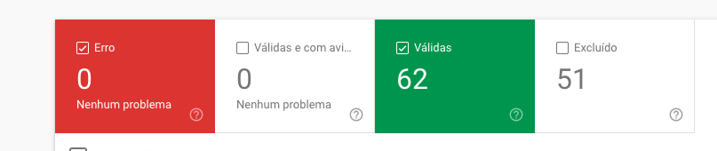

# SEO - Alura

> Notas pessoais para os cursos da formação SEO da Alura

## Sumário

<!-- @import "[TOC]" {cmd="toc" depthFrom=1 depthTo=6 orderedList=false} -->

<!-- code_chunk_output -->

- [SEO - Alura](#seo-alura)
  - [Sumário](#sumário)
  - [Glossário](#glossário)
  - [Iniciando um projeto de SEO](#iniciando-um-projeto-de-seo)
    - [Cobertura](#cobertura)
  - [Ajudando no rastreamento de páginas](#ajudando-no-rastreamento-de-páginas)
  - [Análise de concorrentes](#análise-de-concorrentes)
  - [Funil de buscas](#funil-de-buscas)
    - [Palavras chave](#palavras-chave)
  - [Momentos de busca](#momentos-de-busca)
  - [Tipos de resultados de busca](#tipos-de-resultados-de-busca)
  - [Hierarquia de textos](#hierarquia-de-textos)
  - [Tempo de carregamento](#tempo-de-carregamento)
  - [SEO Para imagens e vídeos](#seo-para-imagens-e-vídeos)
    - [Otimização de imagens](#otimização-de-imagens)
    - [Cuidados com imagens](#cuidados-com-imagens)
    - [Otimização de vídeos](#otimização-de-vídeos)

<!-- /code_chunk_output -->

## Glossário

- __Backlinks__: Links que estão em outro domínio que apontam para o seu site diretamente ou para páginas dentro dele. Este é um dos principais fatores de ranking dentro de uma página do Google. Se o seu site fala de um conteúdo interessante, tanto que outros sites apontam para este conteúdo e fizeram uma menção com um link, isso é um _backlink_. Mas, lembre-se de que a quantidade de links não é a questão mas a qualidade dos sites que apontam para você.
- __Call to Action (CTA)__: Chamada para uma ação específica que o usuário pode fazer. Geralmente aparece em forma de texto. Isso pode ser exemplificado em botões como "Compre agora" ou "Ligue agora".
- __Testes A/B__: Dois tipos de estruturas diferentes ou com elementos diferentes que dividem seu público em duas variantes a fim de entender qual deles performou melhor.
- __HTML com Metadados Estruturados__: Dados estruturados ou _schema_ são palavras usadas no fonte do site que facilitam a identificação de elementos pelos buscadores. Existem dados estruturados para produtos, que nada mais são do que códigos JSON, seguindo um padrão de estrutura. O site [www.schema.org](https://www.schema.org) tem mais informações.
- __Tags e metatags__: São trechos de código que são inseridos no cabeçalhos das páginas, entre as tags `<head></head>`. As metatags são tags com a instrução do nome dela, por exemplo `<title></title>`. Uma metataga especial é a `<meta name="description" content="conteúdo da descrição do site">` essas duas tags são super importantes porque são o título e a descrição que vão aparecer no resultado do site de busca.
- __CTR__: Do inglês, _Click-through Rate_, é a quantidade de links dividido pela quantidade de impressões dele no resultado de busca. Isso significa quantas vezes o seu link apareceu para o usuário e foi clicado. Não há um número ideal para isso, mas, quanto maior o CTR, sinal de que seu link está sendo clicado e exibido bastante.
- __Crawl Budget__: Esse é um dos principais pontos no SEO. Se fossemos traduzir seria algo como o _orçamento de rastreio_ do buscador para varrer o seu site. Os sites precisam ser otimizados para que os buscadores gastem o menor tempo possível varrendo o site e consiga as informações necessárias para ranquear as páginas. Para otimizarmos bem um site temos diversos fatores que podemos pensar: estrutura do HTML, uso correto de meta tags, hospedagem, tempo de carregamento, uso de dados estruturados, conteúdo bem escrito e bem codificado usando estruturas equivalentes (como títulos H1, H2, etc), listas e etc. Quanto mais bem estruturado, melhor o buscador encontra as informações. E em menos tempo.

## Iniciando um projeto de SEO

Para iniciar um projeto de SEO primeiramente precisamos ter contato com as ferramentas que vão nos ajudar a encontrar os resultados que queremos. A principal ferramenta é o [Google Search Console](https://search.google.com/) que é aonde vamos identificar os problemas.

### Cobertura

A cobertura é a quantidade de páginas que o Google está indexando no nosso site. E a quantidade de páginas que o Google está excluindo dele.



As páginas __Válidas__ são aquelas que estão indexadas com sucesso pelo Google. As páginas excluídas são aquelas que não aparecem nos resultados de busca por vários motivos:


Lembrando que nem todas as páginas excluídas precisam de ações imediatas. Um exemplo são páginas com tag canônica adequada, que, segundo a ajuda do Google:

> Página alternativa com tag canônica adequada: essa página é uma cópia de outra que o Google reconhece como canônica. Ela redireciona o usuário corretamente à página canônica. Nesse caso, nenhuma ação é necessária.

Algumas páginas não precisam ser indexadas. Por exemplo, se o intuito da sua página é vender cursos online, então as páginas mais importantes são os cursos, e não as páginas de perfis de usuários e professores. Portanto, podemos excluir automaticamente estas páginas usando a seguinte tag:

```html
<meta name="robots" content="noindex">
```

Ou então pelo próprio search console do Google. Isto é o que chamamos de _Budget Optimization_.

## Ajudando no rastreamento de páginas

O rastreamento por URL contínua é a melhor forma de estruturar o seu site. Isto é chamado de __Arquitetura de URLs__. Um exemplo: Se tivermos uma listagem de cursos online que está na URL `https://site.com.br/topico-do-curso/iniciante` e o curso em si está em `https://site.com.br/curso-propriamente-dito`, não temos o prefixo `topico-do-curso/iniciante`, desta forma o Google não sabe como fazer para continuar o processo.

O ideal seria que o curso estivesse seguindo o modelo de recursos do ReST. Usando a URL `https://site.com.br/topico-do-curso/iniciante/curso-propriamente-dito` e a URL antiga sofra um redirecionamento `301` que significa _Redirecionamento Permanente_, de forma que o Google entende que esta página anterior não existe mais e mudou completamente de endereço.

## Análise de concorrentes

Usando a versão gratuita da ferramenta [SEMRush](https://www.semrush.com/), temos a capacidade de ver aonde nosso site se encontra nas distribuições organicas. Leve em consideração que cada página do Google tem 10 resultados, então o ideal é ter as palavras chaves ranqueadas entre as posições 1~10.

Além disso, a ferramenta possui uma forma de identificar os concorrentes principais e o posicionamento deles dentro das páginas da mesma forma que você pode verificar com seu site.

## Funil de buscas

O funil de buscas é importante para entender como o usuário utilizará a busca. Títulos muito longos podem ser cortados nos resultados, então o ideal é que um título tenha 60 caracteres no máximo.

Também é possível diferenciar a tag `<title></title>` da metatag correspondente, ou seja, é possível ter dois títulos, um para o site e outro para a busca. Muitas vezes temos títulos que são mais curtos para a exibição em uma página e, dentro dela, temos um título mais longo e mais explicativo.

Utilizando a ferramenta gratuita [UberSuggest](https://app.neilpatel.com/pt/ubersuggest) podemos ter uma noção de como as tags rankeiam melhor em nos mecanismos de busca no geral.

### Palavras chave

A própria ferramenta mostra o volume de buscas de uma determinada palavra chave. É importante ter palavras chave com um volume de buscas maior, porém mais difíceis de ranquear, bem como palavras chave com um volume de buscas menor, mas ao mesmo tempo mais simples de serem ranqueadas.

Por exemplo: "Curso de violão" tem mais buscas, porém é mais complicada de ranquear porque é muito genérica. Já "Curso de violão iniciante" tem menos buscas, mas é mais fácil de ranquear porque é mais específica.

## Momentos de busca

Os momentos de busca são extremamente importantes porque o motor de busca vai observar o que está presente no seu site.

O conceito de momentos de busca é um conceito importante dividido em três partes: __Começo, meio e final do funil__.

No começo do funil, serão os usuários que estarão buscando uma cauda mais longa, por exemplo, "Qual é a melhor linguagem de programação para aprender". Ou seja, o usuário ainda não sabe o que ele está procurando. Portanto temos uma palavra chave mais longa.

O meio do funil é quando o usuário já tem uma ideia mas ao mesmo tempo ainda está indeciso, por exemplo, "JavaScript ou Golang?".

E o final do funil é a decisão final do usuário. Por exemplo, "Como aprender JavaScript".

É importante que seu site tenha as três informações para que o usuário se sinta amparado pelas suas escolhas.

## Tipos de resultados de busca

Existem diversos tipos de resultado de busca. Temos os anúncios, que sempre ocupam os primeiros resultados. Temos os vídeos, resultados de localização e então os anúncios orgânicos.

Então a ideia seria sempre mostrar o que o usuário está procurando, sendo o mais direto possível.

## Hierarquia de textos

As header tags `<h1>` até `<h6>`, são importantes porque podemos dizer ao buscador qual é a parte mais importante do site. as tags `h1` são as mais importantes e só pode haver uma delas dentro de cada página. As demais tags são relacionadas a outros títulos.

Geralmente as tags `h2` são subtitulos relacionados a categorias enquanto as tags `h3` são os temas dessas categorias.

## Tempo de carregamento

O tempo de carregamento é uma das partes mais importantes. Uma página lenta vai afastar o possível cliente. Um site gratuito para verificação de tempos é o [Web Page Test](https://www.webpagetest.org/)

## SEO Para imagens e vídeos

### Otimização de imagens

Imagens e vídeos são muito importantes para poder mostrar o que seu conteúdo está dizendo. Buscadores conseguem identificar imagens e mostrá-las para os usuários de forma estruturada.

As principais tags para podermos ranquear bem no google são as propriedades `alt` e `title` de uma image. Então devemos seguir o checklist:

1. A imagem deve sempre possuir um nome que ilustra o que ela está dizendo. Não utilize espaços, sempre `-` no lugar
2. A propriedade `alt` deve dizer exatamente o que existe na imagem, também sem espaços, usando apenas `-`
3. A propriedade `title` é o texto que aparecerá quando o usuário fizer um hover por cima da imagem, neste texto podemos utilizar espaços para descrever exatamente o que está acontecendo.

### Cuidados com imagens

As imagens são pesadas, portanto elas demoram muito para serem carregadas. Uma imagem otimizada tem 72dpi.

Uma outra forma é reduzir o tamanho da mesma reduzindo metadados. Sites como o [TinyPNG](https://tinypng.com) podem fazer a redução da imagem, comprimindo a imagem.

É importante que as imagens sejam otimizadas para manter entre 200kb ou menos.

### Otimização de vídeos

Em vídeos do YouTube (que é uma das maiores ferramentas de busca do mundo), temos que também ter as mesmas ideias do SEO para o site.

Temos que ter as primeiras três linhas com uma pequena descrição, após as primeiras três linhas o Youtube mostra o botão "ver mais". Abaixo disso temos que ter os links diretos para as páginas relevantes, não apenas à home do site.
