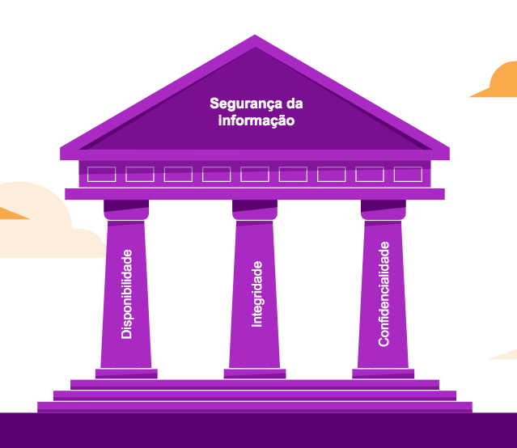
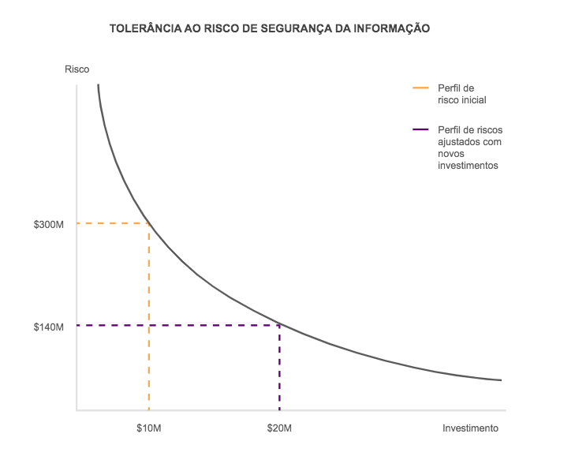
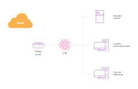
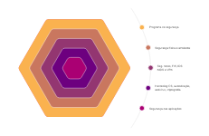

# Sumário

<!-- @import "[TOC]" {cmd="toc" depthFrom=1 depthTo=6 orderedList=false} -->

<!-- code_chunk_output -->

- [Sumário](#sumário)
- [O que é CyberSecurity](#o-que-é-cybersecurity)
- [Por que segurança é importante](#por-que-segurança-é-importante)
- [O que fazer quando se é invadido?](#o-que-fazer-quando-se-é-invadido)
- [Glossário da segurança](#glossário-da-segurança)
  - [Worm](#worm)
  - [DDoS](#ddos)
  - [Invasão](#invasão)
- [Definições sobre CyberSecurity](#definições-sobre-cybersecurity)
  - [Web](#web)
  - [Scan](#scan)
  - [Fraude](#fraude)
- [Cybersecurity vs Information Security](#cybersecurity-vs-information-security)
  - [Definição de segurança da informação](#definição-de-segurança-da-informação)
    - [Confidencialidade](#confidencialidade)
    - [Integridade](#integridade)
    - [Disponibilidade](#disponibilidade)
  - [Outras propriedades da segurança da informação](#outras-propriedades-da-segurança-da-informação)
- [RoSI (Return of Security Investment)](#rosi-return-of-security-investment)
- [Princípios da segurança da informação](#princípios-da-segurança-da-informação)
  - [Privilégios mínimos (least privilege)](#privilégios-mínimos-least-privilege)
  - [Defesa em profundidade](#defesa-em-profundidade)
  - [Elo mais fraco](#elo-mais-fraco)
  - [Ponto de verificação (Checkpoint)](#ponto-de-verificação-checkpoint)
  - [Segurança por obscuridade (Security By Obscurity)](#segurança-por-obscuridade-security-by-obscurity)
  - [Princípio da Simplicidade (KISS - Keep It Simple, Stupid)](#princípio-da-simplicidade-kiss-keep-it-simple-stupid)
  - [Segregação de funções (SOD - Separation of Duties)](#segregação-de-funções-sod-separation-of-duties)

<!-- /code_chunk_output -->

# O que é CyberSecurity

CyberSecurity é redução de riscos de ataque em redes de computadores, softwares ou sistemas computacionais. Quando falamos de cybersegurança estamos falando de um conjunto de ferramentas, metodologias, normas e procedimentos que são utilizados em conjunto com a tecnologia da informação para que possamos prover mais segurança aos dados trafegados.

Quando falamos de segurança não estamos só falando de informação, apesar de ser o bem principal, a segurança vai atuar principalmente em cima de equipamentos ao invés de dados.

# Por que segurança é importante

Quando falamos de segurança digital, estamos falando de um tema que é muito importante e que está causando muito impacto no mundo. Quando falamos de segurança digital não estamos só falando de tecnologia, mas sim de todos os ambitos de uma empresa.

Vamos estar lidando, além das máquinas, com pessoas e todas as áreas da empresa, por exemplo, estaremos falando da pessoa da recepção, zeladores, pessoas que cuidam do estacionamentos e até mesmo os familiares das pessoas importantes, pois estas possuem acesso a informações pertinentes e importantes sobre funcionários e colaboradores das empresas, por isso, chamamos estas pessoas de __colaboradores indiretos__, pois, por exemplo, a esposa de um diretor ou o marido de uma diretora pode ter acesso a informações como horários de saída e até mesmo ao celular do conjuge, o que torna um alvo fácil para ataques.

Quando falamos de cybersecurity estamos falando tanto da defesa quanto do ataque. No termo "politicamente correto", quando falamos de ataque, estamos falando de segurança ofensiva, ou seja, pessoas que são contratadas para poder entrar na empresa se passando por criminosos, justamente para poder antever ações deste tipo

# O que fazer quando se é invadido?

Quando se é invadido, a solução não é simples. Por isto existem orgãos feitos para poder tratar incidentes de defesa de forma coesa. No Brasil, o CertBR é uma organização sem fins lucrativos que trata toda a questão de incidentes, domínios, endereços de IP e etc.

Em cenários como o do WannaCry, empresas e organizações deste tipo são essenciais para poderem criar processos e modelos de mitigação de riscos para empresas. Se elas não existissem, os incidentes posteriores teriam sido muito mais complicados, porque estaríamos mais vulneráveis se não aprendessemos com os erros passados.

# Glossário da segurança

Vamos explicar algumas definições, conceitos, temos e algumas palavras da área de segurança.

## Worm

Um tipo de vírus, nem todos os vírus são iguais, cada tipo de vírus tem uma definição própria. O _worm_ é um tipo de vírus que se propaga lateralmente pela rede como uma minhoca.

O _worm_ tenta achar brechas em redes para se propagar lateralmente pela rede para outros computadores, infectando outros sistemas automaticamente.

## DDoS

O _DoS_ é um __Ataque de Negação de Serviço__ (_Denial of Service_), que é um ataque que faz requisições válidas para um servidor até que ele pare de responder, e negue o serviço.

Um _DDoS_ é a mesma coisa mas de forma __Distribuída__ (_Distributed Denial Of Service_). Geralmente são feitos através de redes de _botnets_, que são redes de computadores infectados quepodem ser controlado por um terceiro malicioso.

## Invasão

O conceito da invasão nada mais é do que um atacante malicioso invade um dispositivo informático para o qual o mesmo não tem acesso.

# Definições sobre CyberSecurity

Vamos conceituar alguns termos importantes em todas as áreas de tecnologia.

## Web

_Web_ e _Internet_ não são a mesma coisa. _Web_ é o termo que define um tipo de aplicação conectada na _Internet_, ou que tem alguma relação com a mesma.

## Scan

Fazer uma varredura na rede em busca de portas ou IPs abertos ou em uma aplicação em busca de pontos de falhas.

## Fraude

Fraude é tentar se passar por algo que você não é. Em termos de segurança, podemos definir que um usuário que tenta acessar um sistema com outra credencial, obviamente, o usuário não é o usuário que foi utilizado.

Phishing, Scam e outros tipos de definições são modelos de fraude.

# Cybersecurity vs Information Security

A segurança cibernética vai tratar dos aspectos mais relacionados à segurança de hardware do seu negócio, enquanto _information security_ é a segurança da informação em si.

Por exemplo, um colaborador do financeiro está na área de copa da empresa discutindo assuntos relacionados à área dela ou dela, porém esta informação não deveria sair da área financeira, portanto a área responsável por não deixar um usuário e uma área fazer isto ou até mesmo conscientizar os funcionários seria a área de __segurança da informação__.

Através da definição de papeis bem exatos podemos mitigar muito melhor os erros e falhas de informação, pois sabemos exatamente onde o erro de comunicação ou erro de segurança ocorreu, pois as pessoas teriam papei muito bem definidos.

## Definição de segurança da informação

Quando temos a definição de informação bem definida e sabemos que ela pode existir de diversas formas e modos como, por exemplo, mídia impressa, falada, eletronica ou física, a definição de _segurança da informação_ é __"A proteção da informação contra diferentes tipos de ameaça com o objetivo de garantir a continuidade do negócio, minimizar os riscos aos quais este possa vir a ser exposto , aumentar o retorno sobre investimentos e as oportunidades de negócio"__

Ou seja, a partir da definição dada pela ISO anteriormente, podemos inferir que temos que preservar aspectos chave: __confidencialidade, integridade e disponibilidade__ da informação. Estes aspectos e propriedades podem ser complementadas por outros aspectos chave como _autenticidade, responsabilidade, não repúdio e confiabilidade_.

### Confidencialidade

Confidencialidade da informação significa que esta deverá ser revelada ou estar somente acessível àqueles que tiverem autorização para tal.

### Integridade

A integridade é a propriedade que garante a exatidão e a plenitude da informação, o que significa que esta não possa sofrer alterações ao longo de seu ciclo de vida, mas sim que tais alterações devem ser legítimas.

### Disponibilidade

A disponibilidade é a propriedade da informação estar disponível e acessível quando necessário aos que forem autorizados.

Além disso é importante notar que, a __disponibilidade__ não é necessariamente deixar um servidor 24x7 no ar, pois, imagine uma situação de um servidor de arquivos que só é acessado das 9 as 18, deixar o mesmo no ar por muito mais tempo aumenta a chance de ataques, mesmo que na rede local, então a questão da disponibilidade é somente para quando temos nossos dados sendo acessados.

A princípio, talvez alguns possam acreditar ser esse o conceito de disponibilidade, entretanto, observando-se o disposto pela ISO/IEC 27001:2005, conclui-se que, na verdade, a disponibilidade de qualquer serviço só é computada (e justificável) durante o período em que seus usuários legítimos o requisitarem em conformidade com as Políticas de Segurança da Informação (PSI) da organização.

Esta tríade representa os pilares básicos da Segurança da Informação, sendo referenciada, em geral, como __CID__.

## Outras propriedades da segurança da informação

A __autenticidade__ tem como objetivo determinar a validade da transmissão da mensagem e de seu remetente, a fim de comprovar a origem e a autoria de um documento; enquanto o __não repúdio__ tem como o objetivo garantir que o autor não possa negar a criação e nem a assinatura do documento.

# RoSI (Return of Security Investment)

O RoSI, da mesma forma que o RoI, é o retorno sobre o investimento em segurança da informação, cujo cálculo poderá responder a questões financeiras essenciais como: __A organização está pagando excessivamente por segurança? Quanto a falta de segurança poderá impactar na produtividade? Quando os investimentos em segurança são suficientes? Essa prática ou esse dispositivo de segurança traz, efetivamente, benefícios?__

> Entretanto temos que notar que o cálculo normal que fazemos para o RoI não se aplica para o RoSI, pois geralmente estamos aplicando o RoSI não para obtenção de lucros, mas para a prevenção de perdas.

A chamada "curva de tolerância ao risco" representa a curva genérica de mitigação dos riscos relacionados à segurança da informação em razão dos investimentos recebidos.

Com base nesta curva, podemos observar que investimentos reduzidos em segurança da informação agravam consideravelmente o risco, podendo também potencializar o impacto sobre o negócio produzido por eventuais incidentes de segurança.

E este impacto pode ir além das perdas financeiras diretas, ocasionando o desgaste da imagem corporativa e da reputação da empresa.

No outro extremo da curva temos que, a partir de um determinado momento, os riscos não poderão ser mais mitigados, independentemente dos investimentos realizados em segurança. Isso torna evidente a necessidade de determinação do ponto de equilíbrio entre risco e investimento, tendo-se como refeência as necessidades e os objetivos do negócio.

# Princípios da segurança da informação

A segurança da informação é baseada em diversos princípios que deverão ser combinados para compor soluções adequadas e abrangentes, capazes de mitigar riscos e reforçar a segurança da informação.

## Privilégios mínimos (least privilege)

Simplificadamente, privilégios remetem às ações que o usuário pode executar em um sis-tema, como, por exemplo, ajustar o horário, configurar a placa de rede ou instalar/desinstalar um aplicativo. Não deve ser confundido com permissões, as quais referem-se ao tipo de acesso ao recurso, como, por exemplo, permissão para abertura de um arquivo para leitura, abertura de um arquivo para escrita (edição) ou, ainda, a criação de um arquivo em um diretório.

Os usuários deverão ter seus privilégios para uso dos recursos informáticos limitados ao mínimo necessário para o pleno desempenho de suas funções, evitando, dessa maneira, a desnecessária exposição a riscos, como, por exemplo, a instalação de códigos maliciosos, conforme anteriormente discutido.

O US-CERT acrescenta ainda que a concessão de privilégios excessivos a um usuário pode permitir que ele venha a obter ou alterar informações de maneira indesejada, mesmo que de maneira involuntária. Logo, a cuidadosa delegação de privilégios poderá contribuir expressivamente para impedir que condutas impróprias ou inadequadas venham a comprometer algum dos pilares da Segurança da Informação e, ainda, para a redução dos riscos para o negócio.

## Defesa em profundidade

A aplicação de um sistema defensivo em __forma de camadas__. No qual diferentes mecanismos de proteção se complementam, apliando a abrangência e a efetividade desse sistema como um todo.

Um exemplo pode ser observado na figura a seguir. Onde um UTM é empregado para proteger a borda entre a rede interna e a rede não confiável (Internet). Apesar de ele ser capaz de inspecionar e disciplinar o tráfego entre as duas, ele não é capaz de detectar e nem proteger os hosts da rede local contra um ataque interno, por exemplo, um ataque de força bruta feito por um usuário interno mal intencionado.

A imagem a seguir define as camadas de segurança de rede:

## Elo mais fraco

Este encadeamento de estratégias de segurança faz com que elas sejam tão fortes quanto seu elo mais fraco. Se encontrarmos o elo mais fraco, com certeza quebraremos todas as partes do encadeamento.

Uma opção seria a implementação de VPN no nosso servidor interno a partir da rede externa. Além disso vamos implementar que os usuários e senhas não podem ser repetidos, expirem a cada 60 dias e são redefinidos e enviados pelo usuário através de uma criptografia PGP.

Bloqueio de acessos, limitação de logins e etc também são técnicas utilizadas para melhorar a segurança do elo mais fraco. Desta forma o atacante pode vir a recorrer a outras técnicas como a engenharia social.

## Ponto de verificação (Checkpoint)

Novamente, na figura, temos um Choke Router + UTM como único ponto de troca para trafego entre a LAN e a Internet.

Deste modo, tal conjunto configura o que é chamado de _checkpoint_, por intermédio do qual __todo o trafego__ entra ou deixa a LAN e pode ser inspecionado e submetido às políticas de segurança.

## Segurança por obscuridade (Security By Obscurity)

A segurança por obscuridade remete a depender de um segredo para manter sua integridade.

Isso significa que, mesmo que um sistema tenha falhas de segurança, desde que as mesmas não sejam conhecidas pelo público geral, não há problema em mante-las.

A OWASP avalia a SbO como um mecanismo extremamente frágil e que, na maior parte das vezes, falha quando é o único controle. Não devido ao fato de que manter segredos seja uma má ideia, mas porque a segurança de um sistema importante não deve depender da ocultação de seus detalhes.

## Princípio da Simplicidade (KISS - Keep It Simple, Stupid)

Segundo o OWASP, a superfície de ataque e a simplicidade são intimamente relacionados, acrescentando ainda que certas práticas da engenharia de software privilegiam abordagens excessivamente complexas, em detrimento de algo mais simples.

O problema é que a complexidade do código dificulta o entendimento e, portanto, influi diretamente na dificuldade em assegurar a existencia de segurança no mesmo.

## Segregação de funções (SOD - Separation of Duties)

A SoD é um controle clássico para resolução de conflitos de interesse e prevenção de fraudes, basicamente, mediante a restrição dos poderes de cada indivíduo e a criação de barreiras, fazendo com que mais de uma pessoa seja necessária para concluir uma tarefa.

A segregação de funções é recomendada no COBIT4.1 com a seguinte frase:

> Implementar uma separação de papéis e responsabilidades que reduza a possibilidade de um único indivíduo subverter um processo crítico. A gerência também deve se certificar de que o pessoal esteja executando apenas tarefas autorizadas relevantes aos seus respectivos cargos e posições.

A OWASP diz que um administrador, por exemplo, deve ser capaz de ligar ou desligar sistemas, ou de implementar uma política de senhas; mas não deve ser capaz de logar como um outro usuário e executar ações em nome dele.

