# Sumário

<!-- @import "[TOC]" {cmd="toc" depthFrom=1 depthTo=6 orderedList=false} -->

<!-- code_chunk_output -->

- [Sumário](#sumário)
- [Fundamentos de redes](#fundamentos-de-redes)
  - [Diagramas de rede](#diagramas-de-rede)
  - [Diagrama de topologia de rede](#diagrama-de-topologia-de-rede)
- [Tipos de redes](#tipos-de-redes)
  - [Rede de Área Local (LAN)](#rede-de-área-local-lan)
  - [Rede de Longa Distância (WAN)](#rede-de-longa-distância-wan)
  - [Outros tipos de rede:](#outros-tipos-de-rede)
  - [Intra e extranet](#intra-e-extranet)
- [Glossário de equipamentos](#glossário-de-equipamentos)
- [Sistemas operacionais de rede](#sistemas-operacionais-de-rede)

<!-- /code_chunk_output -->

# Fundamentos de redes

## Diagramas de rede

Para representar a rede utilizamos desenhos e diagramas.

## Diagrama de topologia de rede

Os diagramas de topologia definem quais serviços estão se comunicando e como eles se comunicam, qual é o fluxo de informação e quais são os dispositivos da rede.

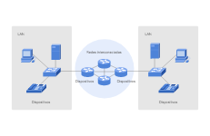

Essas representações são definidas como:

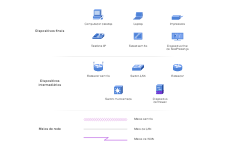

Temos dois tipos de diagramas de topologia:

__Diagrama de topologia física__: Indicam a localização física dos dispositivos intermediários e instalação de cabos.

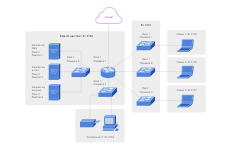

__Diagrama de topologia lógica__: Indicam os dispositivos e o esquema de endereçamento de rede

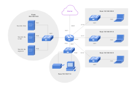

# Tipos de redes

Temos diversos tipos de redes, cada uma delas varia bastante em seus aspectos de conexão, velocidade e cobertura.

## Rede de Área Local (LAN)

É uma infraestrutura de rede que fornece acesso aos usuários e dispositivos finais em uma área geográfica pequena, normalmente em uma rede corporativa, residencial ou de pequena empresa pertencente e gerenciada por uma pessoa só ou um departamento de TI.

No cenário doméstico, esta é a rede de residências, formada pelo seu computador e outros gadgets conectados a um roteador local.

## Rede de Longa Distância (WAN)

Uma infraestrutura de rede que fornece acesso a outras redes em uma grande área, que geralmente pertence ou é gerenciada por um provedor de telecomunicações. Estas redes podem ser servidas como um conector RJ45 mas também tem um modelo coaxial ou fibra óptica

## Outros tipos de rede:

__Rede metropolitana (MAN):__ uma infraestrutura de rede que abrange uma área física maior que uma LAN, porém menor que uma WAN (por exemplo, uma cidade). As MANs normalmente são operadas por uma única entidade, como uma grande organização.

__Wireless LAN (WLAN):__ semelhante a uma LAN, mas interconecta, sem fios, usuários e terminais de uma área geográfica pequena.

__Rede de armazenamento (SAN):__ uma infraestrutura de rede projetada para suportar servidores de arquivos e fornecer armazenamento de dados, recuperação e replicação.

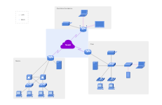

## Intra e extranet

O termo __intranet__ é usado para uma rede de conexões LAN e WAN privadas que pertencem a uma organização e foi projetada para ser acessível somente pelos membros da mesma.

A __extranet__ é utilizada para fornecer acesso seguro e confiável a pessoas que trabalham em diferentes organizações, mas necessitam de dados da empresa, como fornecedores, funcionários, clientes e etc

# Glossário de equipamentos

- __Hubs__: Dispositivos que conectam todos os pontos de rede e repetem os pacotes para a rede toda, todos os pacotes enviados para o hub são repetidos para todos os dispositivos conectados no hub

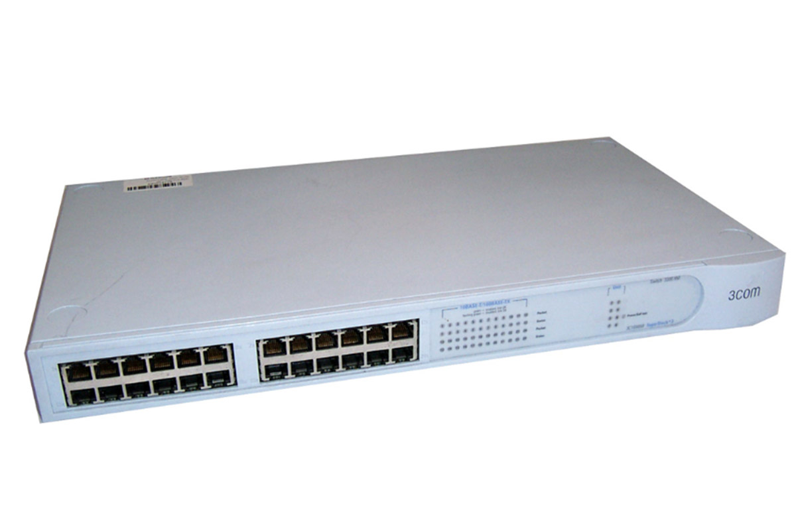

- __Patch Panel__: Organizador de cabos de rede. São usados para promover a conexão entre o cabeamento do rack e as tomadas que vão até os dispositivos evitando que os hosts estejam diretamente conectados nos switches.

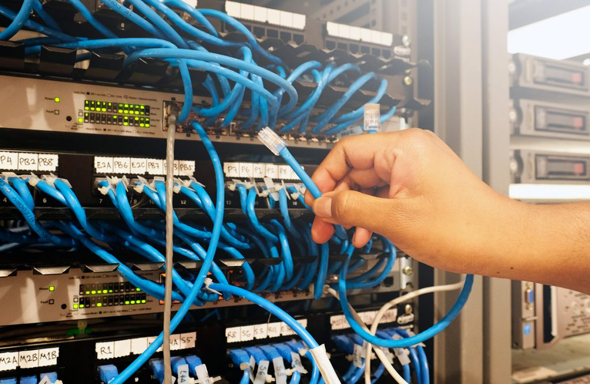

- __Switch__: Evolução do hub pois tem a capacidade de identificar MAC addresses e direcionar os pacotes somente para o destinatário correto, evitando assim spam de rede.

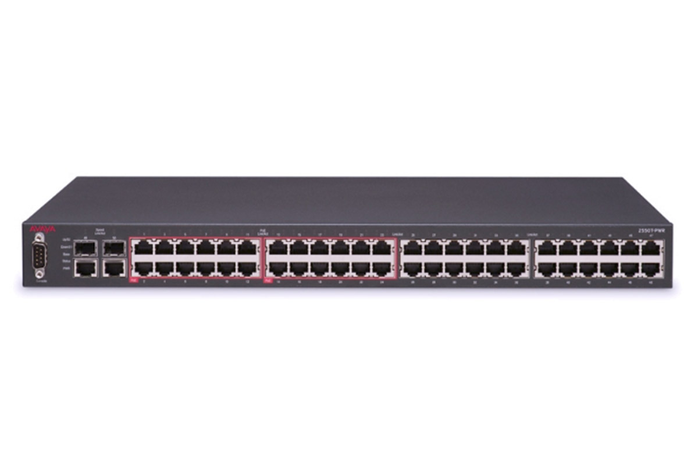

  - __Cascateamento de Switches__: Ligar um switch a outro por uma das portas ativas do dispositivo (as portas de rede), a implementação é barata, porém não é recomendável, já que gera muitos pontos de falha de trafego.

  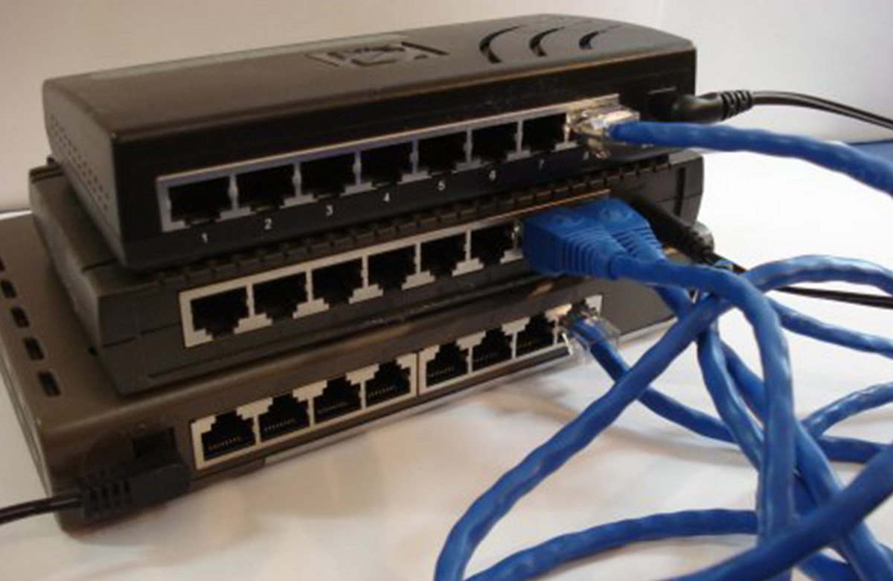

  - __Empilhamento de Switches__: Conectar um switch a outro através de uma porta extensora, de forma que todos os equipamentos funcionem como um só

  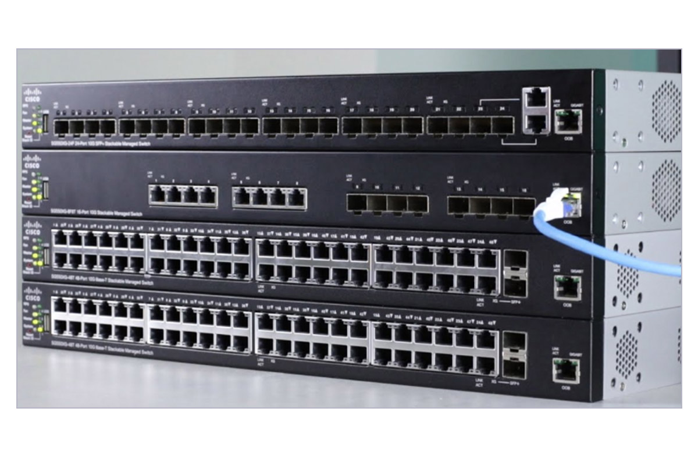

- __Access Point__: Centralizadores de dispositivos inteligados sem fio. É o equipamento que vai gerenciar as conexões sem fio em uma rede local

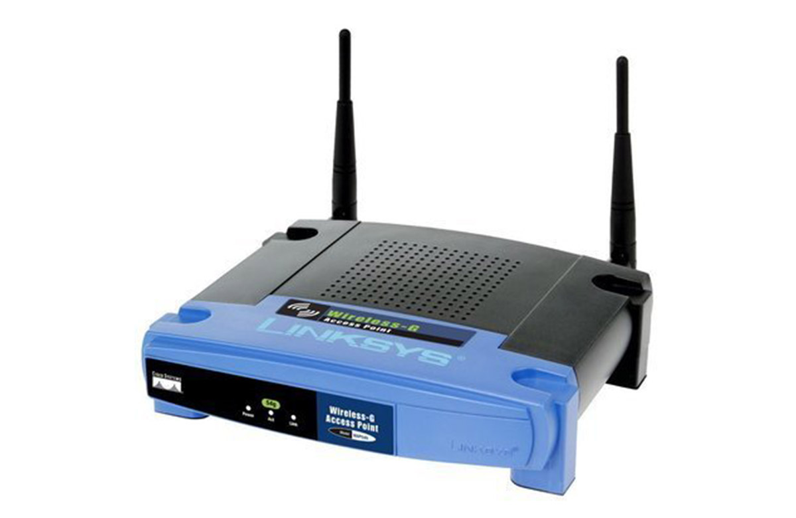

- __Modem:__ Modula e desmodula os sinais de rede para o meio físico

# Sistemas operacionais de rede

Todo o dispositivo de rede vem com um sistema operacional capaz de lidar com a lógica de rede. Temos o __Cisco Internetwork Operating System (Cisco IOS)__ que é um termo genérico para o conjunto de sistemas operacionais de rede usados por dispositivos de rede.

A parte do SO que interage diretamente com o hardware é conhecida como _Kernel_. A camada que envolve o _Kernel_ é uma camada de aplicação que possui um _shell_ e é por meio dela que é criada a interface com o usuário. De forma que o mesmo jamais utiliza o _kernel_ diretamente.

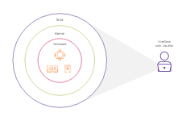
