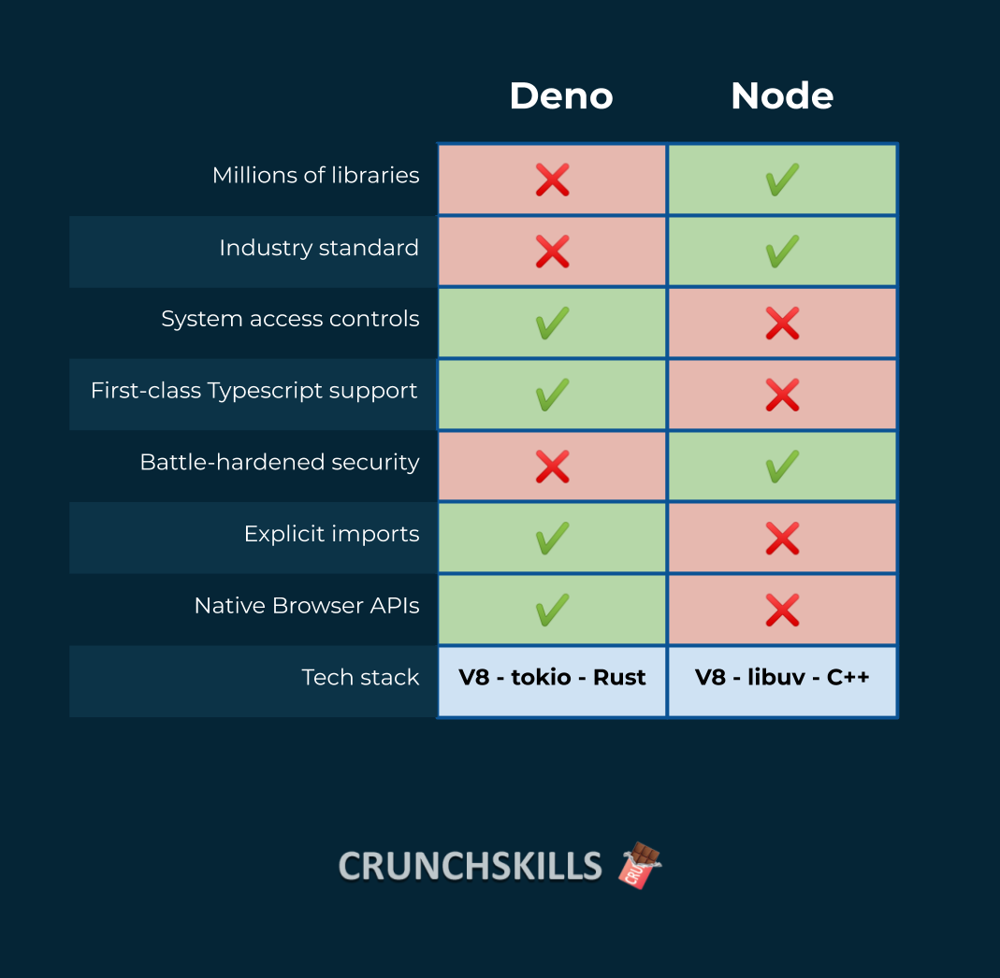
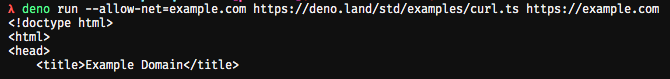
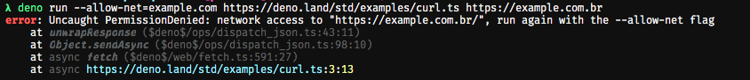

# Deno

> Typescript runtime, tipo o Node, mas ao contrário

## Sumário

<!-- @import "[TOC]" {cmd="toc" depthFrom=1 depthTo=6 orderedList=false} -->

<!-- code_chunk_output -->

- [Deno](#deno)
  - [Sumário](#sumário)
  - [O que é](#o-que-é)
  - [Comparando com o Node.js](#comparando-com-o-nodejs)
    - [Por que o Deno surgiu](#por-que-o-deno-surgiu)
  - [Instalação](#instalação)
  - [Setup de ambiente](#setup-de-ambiente)
    - [VSCode](#vscode)
  - [Exemplos](#exemplos)
  - [Hello World](#hello-world)
    - [Utilizando scripts simples](#utilizando-scripts-simples)
  - [Fazendo uma request web](#fazendo-uma-request-web)
  - [Lendo arquivos](#lendo-arquivos)
  - [Copiando arquivos com a lib fs](#copiando-arquivos-com-a-lib-fs)
  - [Referências](#referências)

<!-- /code_chunk_output -->

## O que é

Deno é um runtime de execução JavaScript/TypeScript no servidor, o propósito do Deno é o mesmo do Node.js porém com algumas mudanças principalmente no que diz respeito à segurança e execução de código.

As principais diferenças do Deno em relação ao Node são:

- Executa TypeScript nativamente
- Precisa de permissão explícita para poder executar alguns módulos, como rede e armazenamento
- Não possui um sistema de gerenciamento de pacotes como o NPM
  - Ao invés disso os pacotes são baixados diretamente pela URL da lib
- `require` não é suportado
  - Todos os módulos precisam ter `.ts` no final
- Ele só possui um executável no final, o `deno`
- Já possui algumas funcionalidades built-in como um inspetor de dependencias `deno info` e um formatador de código `deno fmt`
- Todos os scripts podem sofrer um `bundle` em um único arquivo JS
- Possui uma série de [módulos auditados pelo core team](https://github.com/denoland/deno/tree/master/std) que são garantidos de funcionarem com o Deno
  - Isso faz com que a API do core seja bem menor
  - Enquanto disponibiliza uma stdlib sem dependências externas

## Comparando com o Node.js



- Deno não usa NPM
- Deno não usa `package.json`
- Deno precisa de permissões explicitas para `fs`, `network` e acesso a qualquer coisa que seja do ambiente
- O Deno __sempre__ vai dar um `panic` e morrer em erros não tratados
- Usa `import` (ES Modules) ao invés do `require()` do CommonJS e todos os módulos são importados por URLs como `import * as log from "https://deno.land/std/log/mod.ts"`
- O Deno está atrás de uma compatibilidade maior com Browsers através de mais WebAPIs
- Deno tem Top-Level Await
- Deno é construído em Rust então o próprio ecossistema da linguagem e a forma como o package manager do rust funciona pode permitir que usuários criem suas versões modificadas so Deno, como, por exemplo, um Electron

Além disso todos os códigos remotos são baixados e cacheados na primeira execução e não são mais atualizados até o código do usuário ser executado com a flag `--reload`. O que significa que você pode baixar e atualizar seus pacotes mesmo sem rede.

Uma outra coisa interessante que o Deno permite é a execução de código pela linha de comando direto de uma URL, por exemplo: `deno run --allow-net=example.com https://deno.land/std/examples/curl.ts https://example.com`, que permite executar um código da stdlib diretamente passando como permissão somente o site necessário:



Se tentarmos executar em outro site:



### Por que o Deno surgiu

Em uma [palestra](https://www.youtube.com/watch?v=M3BM9TB-8yA) em 2018, Ryan Dahl citou 10 coisas que ele se arrependeu de ter feito no Node.js:

1. Não ter continuado com a API de promises em 2009
2. Segurança
    - O V8 em si é bastante seguro
    - Mas outras aplicações externas não deveriam ter acesso a todo o seu sistema de arquivos ou então sua rede, por exemplo, seu linter não precisaria disso
3. O sistema de build (GYP)
4. O Package.json
    - Contém muita informação extra desnecessária
    - Centralização de pacotes
5. Node Modules
    - Pesado
    - Repetitivo
    - Complica o algoritmo de resolução de módulos
6. `require` sem o `.js` no final do arquivo
    - Adiciona complexidade ao algoritmo de resolução de módulos para entender o que o usuário quis dizer
7. `index.js` como entrypoint

## Instalação

Siga [a página oficial](https://deno.land/manual/getting_started/installation)

## Setup de ambiente

### VSCode

Para o VSCode temos a [extensão oficial do Deno](https://marketplace.visualstudio.com/items?itemName=justjavac.vscode-deno&WT.mc_id=mynotes-github-ludossan) que faz algumas alterações na execução padrão do TS para os arquivos do Deno.

## Exemplos

Vamos a alguns programas de exemplo

## Hello World

Para criar um programa `hello-world` basta abrir uma pasta como temos [aqui](./examples/hello-world) e criar um arquivo `index.ts`:

```typescript
console.log('Hello World')
```

Depois utilizar o comando `deno run index.ts`.

### Utilizando scripts simples

Como o Deno não possui ainda um package manager, e nem vai possuir de acordo com as documentações e os objetivos do projeto, ficamos defasados no uso do `npm run` ou `npm start`. Para evitar que precisemos digitar todas as vezes o comando que queremos rodar com o nome do arquivo, podemos simplesmente utilizar o que já era utilizando anteriormente para arquivos binários em C, o __Makefile__.

Basta criar um arquivo `makefile` na raiz do seu projeto e escrever os scripts:

```makefile
nome-do-script:
    script a ser executado
```

Por exemplo:

```makefile
run:
    deno run index.ts
```

> Veja mais sobre o Makefile [aqui](https://makefiletutorial.com/).

## Fazendo uma request web

Como podemos ver no [repositório de exemplo](./examples/deno-http-request), para fazer uma request com o Deno é mais simples do que com o Node.js porque não precisamos de um módulo externo para se comportar como o `fetch` do Browser. O Deno já possui o objeto `fetch` nativamente. Então podemo utilizá-lo logo de cara.

No primeiro exemplo, vamos fazer uma requisição para a URL passada por parâmetro e depois vamos printar o resultado em JSON na tela:

```typescript
const url = Deno.args[0]
const res = await fetch(url)

const body = await res.json()
console.log(body)
```

Note que podemos utilizar o Top-Level-Await que é uma especificação do ECMA262 que está vindo para o JS.

Além disso podemos também transformar nossos dados em uma stream e carregá-los diretamente para o stdout à medida que eles são lidos:

```typescript
const url = Deno.args[0]
const res = await fetch(url)

const body = new Uint8Array(await res.arrayBuffer())
Deno.stdout.write(body)
```

## Lendo arquivos

O Deno tem uma abstração chamada `Deno.File` que representa um arquivo no SO. Essa abstração raramente será utilizada de forma natural, porém o Deno também possui uma série de APIs nativas para a utilização em FS, como o módulo `fs` do Node, porém nativo da API.

Para ler um arquivo basta executar o comando `Deno.open(filename)` e este comando vai te retornar uma instancia de `File` que pode ser manipulada com `Deno.copy`, o que isto faz é copiar o conteúdo de uma stream para outra:

```typescript
const filenames = Deno.args

for (const filename of filenames) {
  const file = await Deno.open(filename)
  await Deno.copy(file, Deno.stdout)
  file.close()
}
```

Podemos criar um Makefile igual ao que criamos para o fetch:

```makefile
run:
  deno run --allow-read index.ts $(FILE)
```

Depois temos que rodar com o comando: `make FILE=./arquivo`.

## Copiando arquivos com a lib fs


## Referências

- https://stackoverflow.com/questions/61949441/difference-between-deno-and-nodejs
- https://medium.com/@raj.fungus/what-is-deno-is-nodejs-dead-4fea8d447be9
- https://medium.com/@rlogicaltech/whats-deno-understanding-of-deno-framework-cab06b2b11b2
- https://crunchskills.com/deno-vs-node/
- https://www.youtube.com/watch?v=M3BM9TB-8yA
- https://deno.land/manual/getting_started/first_steps
- https://makefiletutorial.com/
