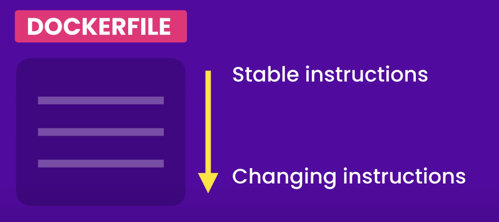

# **Docker Learning**

### *Docker is nothing but a platform for running,building and shipping containers.*

- Before diving into docker it is very important to be crystal clear about the difference between two things that is *`virtual machine`* and *`container`*.

- **Virtual Machine**:Virtual machine is just an abstration of physical hardware. We can run several isolated virtual machnes on a single physical machine. Suppose if you have a macbook machine you can run both Windows & Linux on top of it using a tool called hypervisor which is a software to create and  manage virtual machines. Some of commonly used hypervisors are Virtual Box and VMware.

- **Container**:A container is a nothing just an operating system virtualization.It provides us an isolated environment for running applications on a single operating system.A docker container technically an OS process having its own file system provided by docker image and all containers share kernel of host OS.

- **Image**:A Docker image is a file used to execute code in a Docker container.It consists of cut-dow OS,dependencies,environment variables,third party libraries and everything an application requires to run.

- **Workflow of Docker**: Before the advent of docker,there often arised situations where an application runs on a developer's machine but fails to run on production machine due to reasons like version mismatch,different configuration settings etc.However after advent of docker you can package all essential components required by an apllication into an image and push it on dockerhub and then you can pull on it you production machine and run it inside docker containers.

- **Dockerfile**:All instructions for building an image is written into Dockerfile.

## Why prefer containers over VM's?

- VM is resource intesnsive as it has its own OS and takes a slice of hardware where as containers are lightweight because they are just special types of processes.
- Time taken to start a container is much less than time taken to start a VM.

## Some Common Dockerfile Instructions

- `FROM` : Specify base image
- `WORKDIR` : Set current working directory image
- `COPY` : Copy files/directories from your machine into image.
- `ADD` : Copy files/directories from your machine and URL's into image.

- `RUN` : Run Commands at build time
- `ENV` : Set Environment Variables
- `EXPOSE` : Document the port container is listening on.
- `USER` : Specify the user that should run the application.
- `CMD` : Run Commands at conatiner run time but these commands can be overridden.
- `ENTRYPOINT` : Run Commands at conatiner run time than can be overriden by using `--entrypoint` flag.

## Shell Form vs Executale Form

- Refer this snippet

    ```bash
    #shell form : Command is executed in a seperate shell 
    # /bin/sh - Linux origional shell program
    # cmd - Windows original shell program
    CMD npm start

    # Exec form : Execute command directly
    # Recommed beacuse its easier to clean up resources when containers stop
    CMD ["npm","start"]
    ```

### Fun Facts

- We can't run Windows 10 container on a linux machine but we can run a linux container on a Windows 10 machine.
- MacOS don't have inbuilt support for containers so docker uses a lightweight linux VM to run linux containers.
- We should never specify user as root user in Dockerfile.
- Like .gitignore we also have .dockerignore

**Refer *helper* branch to see get overview of linux and basic docker commands❤️❤️**

# Dockerizing a React App

- Generally to start a create and run a simple React Application we have to do the following steps-:
  
  - Install node.js
  - Run `npm i create-react-app`
  - Run `npx create-react-app`
  - Run `npm start`

- After this create a .dockerignorefile and add node_modules to it

- Move to the directory where the react app is located and add the following commands in the Dockerfile

  ```bash
  FROM node:current-alpine3.16
  RUN addgroup developers && adduser -S -G developer dhairya   <!-- We donot have useradd in alpine -->
  USER dhairya
  WORKDIR /app
  COPY . .          <!-- add node_modules in .dockerignore -->
  EXPOSE 3000
  ENV API_URL=http://xyz.com
  CMD npm start
  ```

- Build the image from the Dockerfile
  
  ```bash
  docker build -t hello-react ./
  ```

  - Here `-t` flag is used to tag image.
  - "hello-react" is the name of the image.
  - `./` specifies the location of Dockerfile.
  - Docker-Client will sets the context of this directory i.e `./` to the Docker-Engine known as BuildContext.
  - Docker-Engine will not ave access o files and directories outside the BuildContext

- To view all images on the machine use any of the following-:

  ```bash
  docker image ls
  ```

  ```bash
  docker images
  ```

- Run the docker image

  ```bash
  docker run -it hello-react
  ```

  - `-it` specifies interactive mode.

- The above command will run the node command line.So use this command

  ```
  docker run -it hello-react bash // Throw error in alpine linux 
  docker run -it hello-react sh   //App will run successfully in alpine linux 
  ```

### Fun Facts 2.0

- Like .gitignore we also have .dockerignore
- We use apk instead of apt in alpine linux.
- To show all environment variables run `printenv`
- To print a particular environment variable value run `printenv JAVA_HOME'` or `echo $JAVA_HOME`

# Speeding Up Build

- **Layers** : A docker image is a collection of layers.Its just like a small file system that includes modified files.
- When docker executes the instructions from a Dockerfile,it create new layers which include the files that were modified as a result of that particular instruction.
- To see layers of the react app we deployed run

  ```bash
  docker history hello-react
  ```

- You will notice that many instructions also came from node base image and brought in several layers.
- Now,next time when we will build this image, it will reuse the layers of unchanged from the cache.
- However, when it encounters a changed instruction all the instruction below it has its layers to be rebuilt.
- So our flow while writing Dockerfile script is-:
    
- So we should the the code-1 with code-2 in our react-app.

  - Code-1

      ```bash
        COPY . .
        npm install
      ```

  - Code-2

      ```bash
        COPY package*.json ./
        npm install
        COPY . .
      ```

# Tagging Images

- If you run `docker images` , you will see al images marked with latest tag that is default tag.
- We should not use "latest" but custom tags in production for easier debugging. Instead we an use build numbers.
- With same Dockerfile,you can create different images with diferent tags.
- We always address image as `image-name:tag-name`
- To tag images-:

  ```bash
    docker tag image1:tag1 image2:tag2
  ```

## Saving & Loading Images

- Saving Image

  ```bash
  docker image save -o xyz.tar image-name:tag-name
  ```

- Loading Image

  ```bash
  docker image load -i xyz.tar
  ```

# Containers Commands

- ## Removing Containers
  - Similar commands are there for dangling images.
  ```bash
  docker container rm <containerID>
  docker rm <containerID>
  docker rm -f <containerID>        #force removal
  docker container prune            # to remove stopped containers
  ```
- ## Running Containers
  
  ```bash
    docker run <image>
    docker run -d <image>              # run in the background
    docker run —name <name> <image>    # to give a custom name
    docker run —p 3000:3000 <image>    # to publish a port HOST:CONTAINER
  ```
- ## Listing Containers
  
  ```bash
      docker ps# to list running containers
      docker ps -a   # to list all containers
  ```

- ## View Logs
  
  ```bash
    docker logs <containerID>
    docker logs -f <containerID>       # to follow the log(realtime)
    docker logs —t <containerID>       # to add timestamps
    docker logs —n 10 <containerID>    # to view the last 10 lines
  ```

- ## Executing Commands in running containers
  
  ```bash
  docker exec <containerID> <cmd>
  docker exec -it <containerID> sh   # to start a shell
  ``` 
    -  First time the commands will run in the current working directory set in dockerfile.
    -  You can start in interactive mode using `-it`.

- ## Starting and stopping containers
  
  ```bash
  docker stop <containerID> 
  docker start <containerID
  ```

- ## Sharing source code with containers
  
  ```bash
  docker run -v $(pwd):/app <image>
  ```

- ## Copying files beween host & containers
  
  ```bash
  docker cp <containerID>:/app/log.txt .
  docker cp secret.txt <containerID>:/app
  ```

- ## Volumes
  
  ```bash
  docker volume ls
  docker volume create app-data
  docker volume inspect app-data
  docker run -v app-data:/app/data <image>
  ```

# Some Important docker-compose commands

```bash
docker-compose build
docker-compose build --no-cache
docker-compose up
docker-compose up -d
docker-compose up —build
docker-compose down
docker-compose ps
docker-compose logs
```

