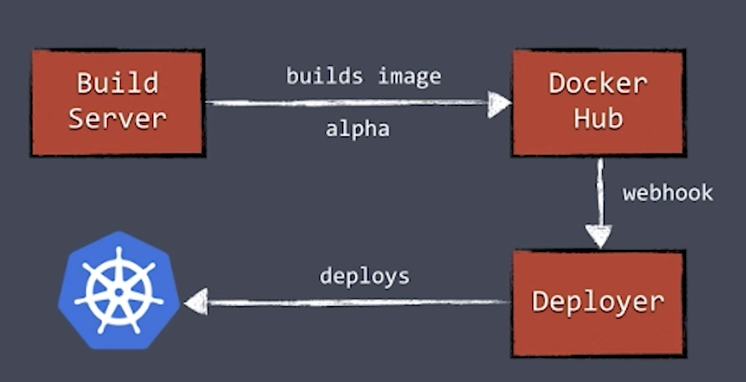

# Curso de Kubernetes Microsoft

## Containers

Vamos utilizar containers para poder subir nossas aplicações no Kubernetes, para isso precisaremos de um tipo de registro aonde vamos armazenar nossas
imagens, isso pode ser feito no próprio Docker Hub ou então em qualquer outro tipo de registro de containers gerenciado por empresas como o Google ou
a Azure.

### O que é um container

É uma definição de logística de uma caixa que pode ser utilizada para transporte. O container é construído para ser resistente e para ser
reutilizado várias vezes.

Da mesma forma, em serviços, os containers são processos que podem ser isolados dos demais serviços como uma caixa.

## Datacenter orientado a código

- Abstração de todos os recursos de hardware
- Pool de recursos
- Provisionamento automático

Tudo isso gerenciado por arquivo imutáveis que permitem que a gente consiga construir a infraestrutura de forma simples e versionável.

Podemos ter um Pool de recursos de Memória, processamento e armazenamento, que podemos ampliar de acordo com o uso.

### Vantagens de se utilizar a nuvem

- Gerenciamento de energia
- Segurança terceirizada
- Atualizações e patches de segurança
- Paga somente o que usar
- Escalabilidade por necessidade
- Menos configurações
 
## Docker

O docker é um sistema de gerenciamento de containers que permite, entre outras coisas:

- Unificação entre ambientes de produção e desenvolvimento
- Possibilidade de manter o ambiente limpo
- Reutilização de imagens e a comunicação entre esses containers através de redes internas
- Possibilidade de criar receitas de como essa aplicação vai funcionar

## Kubernetes

- Orquestrar containers em multiplos hosts em multiplas regiões
- Controlar e automatizar processos de deploys e updates
- Auto-replacement, auto-restart, auto-replication e auto-scaling
- Rolling updates e load balancers

Age como uma camada entre o host e os containers.

## Clusters

### Master

- Control Plan: Plano de controle do cluster
- Scheduler: Gerenciam os pods e os containers
- API Server: Faz a interface com os clientes que interagem com o Kubernetes
- Node Controller: Realiza o controle do estados dos nós
- Cluster Store (etcd): Realiza o armazenamento dos estados dos nós

### Nodes

O nodes possuem um conjunto de sistemas individuais que trabalham juntos para poder fazer com que todo o cluster funcionar.

- Kubelet: Responsável por reportar ao master o que houve com o Node, também é o responsável por mandar health checks
- Container Runtime: É o sistema de gerenciamento de containers, que contem as nossas aplicações em si
- Network Proxy: Os sistemas dentro do node, bem como o Node em si, podem se comunicar internamente com outros nós e outras aplicações
  que já estão rodando dentro do cluster através de uma rede interna

## Workloads

### Pods e containers

Um pod é a menor unidade do Kubernetes. Você pode ter mais de um container em um Pod, conversando com outros containers dentro do mesmo pod.
Isto traz alguns problemas:

- Se o Pod cair, todos os containers caem junto
- Todos os containers compartilham os mesmos recursos
- Todos os pods compartilham a mesma rede

Por isto este modelo não é muito utilizado, e não deve ser muito utilizado. O ideal seria que cada container tenha seu próprio Pod e que eles se
comuniquem internamente usando o proxy interno do próprio Kubernetes.

Alguns casos específicos, como aplicações de Logging que precisam estar totalmente ligadas umas as outras. Se uma aplicação cai então não existe
motivo para seu log continuar inteiro e funcionando.
