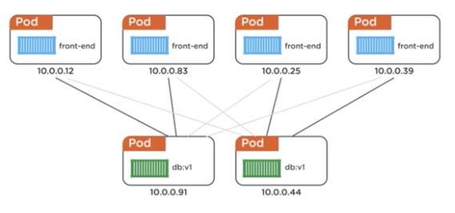
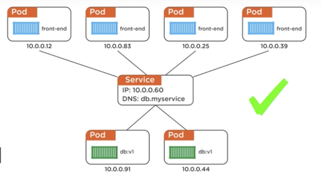
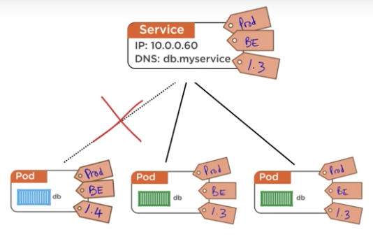
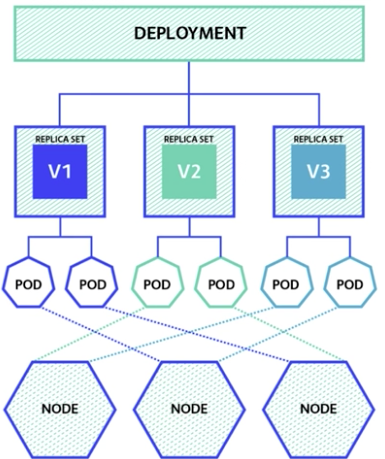

# Curso de Kubernetes Microsoft

<!-- TOC -->

- [Curso de Kubernetes Microsoft](#curso-de-kubernetes-microsoft)
  - [Containers](#containers)
    - [O que é um container](#o-que-é-um-container)
  - [Datacenter orientado a código](#datacenter-orientado-a-código)
    - [Vantagens de se utilizar a nuvem](#vantagens-de-se-utilizar-a-nuvem)
  - [Docker](#docker)
  - [Kubernetes](#kubernetes)
  - [Clusters](#clusters)
    - [Master](#master)
    - [Nodes](#nodes)
  - [Workloads](#workloads)
    - [Pods e containers](#pods-e-containers)
    - [Services](#services)
      - [Service Labels](#service-labels)
    - [Deployments](#deployments)
    - [Pods](#pods)
      - [Modelo Iterativo](#modelo-iterativo)
      - [Modelo declarativo](#modelo-declarativo)
      - [Gerenciamento de pods](#gerenciamento-de-pods)
    - [Secrets](#secrets)
      - [Usando secrets para imagens privadas](#usando-secrets-para-imagens-privadas)
        - [Mapeando um secret em um pod](#mapeando-um-secret-em-um-pod)
    - [ReplicaSets](#replicasets)

<!-- /TOC -->

## Containers

Vamos utilizar containers para poder subir nossas aplicações no Kubernetes, para isso precisaremos de um tipo de registro aonde vamos armazenar nossas
imagens, isso pode ser feito no próprio Docker Hub ou então em qualquer outro tipo de registro de containers gerenciado por empresas como o Google ou
a Azure.


### O que é um container

É uma definição de logística de uma caixa que pode ser utilizada para transporte. O container é construído para ser resistente e para ser
reutilizado várias vezes.

Da mesma forma, em serviços, os containers são processos que podem ser isolados dos demais serviços como uma caixa.

## Datacenter orientado a código

- Abstração de todos os recursos de hardware
- Pool de recursos
- Provisionamento automático

Tudo isso gerenciado por arquivo imutáveis que permitem que a gente consiga construir a infraestrutura de forma simples e versionável.

Podemos ter um Pool de recursos de Memória, processamento e armazenamento, que podemos ampliar de acordo com o uso.

### Vantagens de se utilizar a nuvem

- Gerenciamento de energia
- Segurança terceirizada
- Atualizações e patches de segurança
- Paga somente o que usar
- Escalabilidade por necessidade
- Menos configurações

## Docker

O docker é um sistema de gerenciamento de containers que permite, entre outras coisas:

- Unificação entre ambientes de produção e desenvolvimento
- Possibilidade de manter o ambiente limpo
- Reutilização de imagens e a comunicação entre esses containers através de redes internas
- Possibilidade de criar receitas de como essa aplicação vai funcionar

## Kubernetes

- Orquestrar containers em multiplos hosts em multiplas regiões
- Controlar e automatizar processos de deploys e updates
- Auto-replacement, auto-restart, auto-replication e auto-scaling
- Rolling updates e load balancers

Age como uma camada entre o host e os containers.

## Clusters

### Master

- Control Plan: Plano de controle do cluster
- Scheduler: Gerenciam os pods e os containers
- API Server: Faz a interface com os clientes que interagem com o Kubernetes
- Node Controller: Realiza o controle do estados dos nós
- Cluster Store (etcd): Realiza o armazenamento dos estados dos nós

### Nodes

O nodes possuem um conjunto de sistemas individuais que trabalham juntos para poder fazer com que todo o cluster funcionar.

- Kubelet: Responsável por reportar ao master o que houve com o Node, também é o responsável por mandar health checks
- Container Runtime: É o sistema de gerenciamento de containers, que contem as nossas aplicações em si
- Network Proxy: Os sistemas dentro do node, bem como o Node em si, podem se comunicar internamente com outros nós e outras aplicações
  que já estão rodando dentro do cluster através de uma rede interna

## Workloads

### Pods e containers

Um pod é a menor unidade do Kubernetes. Você pode ter mais de um container em um Pod, conversando com outros containers dentro do mesmo pod.
Isto traz alguns problemas:

- Se o Pod cair, todos os containers caem junto
- Todos os containers compartilham os mesmos recursos
- Todos os pods compartilham a mesma rede

Por isto este modelo não é muito utilizado, e não deve ser muito utilizado. O ideal seria que cada container tenha seu próprio Pod e que eles se
comuniquem internamente usando o proxy interno do próprio Kubernetes.

Alguns casos específicos, como aplicações de Logging que precisam estar totalmente ligadas umas as outras. Se uma aplicação cai então não existe
motivo para seu log continuar inteiro e funcionando.

### Services

No Kubernetes, os Pods são totalmente descartáveis. Porém dentro do nó temos nossa rede interna, como podemos garantir que um pod vai continuar com o
mesmo IP da rede interna até depois da sua morte?



Na foto anterior, temos dois bancos de dados onde metade dos pods se conectam com um e a outra metade no outro. Se um desses pods de bancos de dados caírem, não vamos conseguir ter conexão a partir de metade de nossos pods front-end.

Para resolver esse problema, colocamos um serviço na frente dos pods de bancos de dados para gerenciar os IPs.



O service vai fazer o bind entre os IPs e os pods finais.

#### Service Labels

Cada service é atrelado a uma label, a label é o modelo de organização disponível no Kubernetes. Então, se quisermos que o service só gerencie os pods com a label da versão 1.3, iremos tagear todos esses pods com essa label e automaticamente o serviço vai se ligar a esses pods.



Caso criemos uma nova versão, digamos, 1.4, o pod já não será mais gerenciado por este service.

### Deployments

Deployments são agrupamentos e gerenciamentos de pods através de Replicasets



O Deployment permite uma série de coisas:

- Múltiplas versões concorrentes
- Testes blue/green
- Versionamento de rollbacks
- Auto rollback em caso de falha de deploy

O Deployment irá sempre manter o estado corrente da aplicação independente de quantos pods você delete.

### Pods

#### Modelo Iterativo

O modelo interativo é o que chamamos o modo de linha de comando que utilizamos para rodar nossas aplicações.

Por exeplo, para executarmos um pod simples podemos usar o comando:

```bash
kubectl run mongodb --image mongo:3.5 --port 27017
```

Para podermos ver os nossos pods vamos usar o comando `kubectl get pods` e para deletar o pod vamos utilizar o comando `kubectl delete pod
<nome-do-pod>`.

> Se utilizarmos as flags `-o wide` ou `--output=wide` vamos ter um resultado com mais informações no comando `get pods`

Podemos obter mais informações através do comando `kubectl describe pod <nome-do-pod>`, vamos ter todas as informações de metadados e também
variáveis, ou seja, tudo que pode ser visto a partir dele.

Podemos também verficar o quanto de memória e CPU um pod está gastando usando o comando `kubectl top <nome-do-pod>`.

Vamos rodar outra aplicação utilizando o comando `kubectl run api-heroes --image erickwendel/api-heroes:v1 --env "MONGO_URL=10.244.0.11" --env "PORT=4000" --replicas 2`. Desta forma vamos ter uma aplicação com algumas variáveis de ambiente, como o `PORT` e o `MONGO_URL` e também o número de
replicas iniciais.

Podemos ver os logs através do `kubectl logs <podname>`.

Para expormos um pod para o mundo, podemos utilizar o comando `kubectl expose pod <nomedopod> --port 4000 --type LoadBalancer`. Essencialmente vamos
ter um pod exposto para o mundo na porta 4000, com o tipo `LoadBalancer`, este tipo define que vamos ter um serviço alocado no tipo `LoadBalancer`,
que é um tipo de serviço exposto para a internet que pode ou não ter mais de um pod associado, assim ele vai funcionar como um balanceador de carga.

#### Modelo declarativo

Podemos gerenciar todos os workloads do kubernetes por arquivos manifesto arquivos em `yaml` ou `json`.

Vamos criar os mesmos pods que criamos anteriormente em um arquivo `JSON` desta forma:

```json
{
  "apiVersion": "v1",
  "kind": "pod",
  "metadata": { // Aqui vamos ter metadados sobre o pod, informações internas do cluster
    "name": "api-heroes-pod", // Nome interno do pod (até 15 chars)
    "labels": { // Identificadores dos pods, é o único meio de agrupar recursos no k8s
      "version": "1.0", // Uma label de versão
      "app": "api-heroes" // Outra label com o nome da nossa app
    }
  },
  "spec": { // Maneira como o pod tem de se comportar
    "containers": [ // Informações sobre os containers que vão rodar no pod
      {
        "name": "api-heroes",
        "image": "erickwendel/api-heroes:v1",
        "ports": [{
          "containerPort": 4000 // Porta interna do container
        }],
        "env": [ // Variáveis de ambiente
          {
            "name": "MONGODB_URL",
            "value": "10.244.0.11"
          },
          {
            "name": "PORT",
            "value": 4000
          }
        ]
      }
    ]
  }
}
```

Para podermos criar o workload no cluster, basta que executemos o comando `kubectl create -f <arquivo>.json`. A partir daí todos os comandos de pods são funcionais. Além disso podemos também deletar ou modificar pods a partir de identificadores de label com o comando `kubectl delete pod -l version=1.0`.

> Podemos obter o IP através do comando `kubectl describe pod mongodb -o wide"

#### Gerenciamento de pods

Como podemos gerenciar nossos pods quando temos algum tipo de problema?

- Logs: `kubectl logs <nome-do-pod>`
- Acessar o container: `kubectl exec -it <nome-do-pod> -- <comando>`

Podemos utilizar o comando `explain` para trazer as explicações e também os comandos que podemos utilizar de qualquer tipo de workload desta forma: `kubectl explain pods`, ou também `kubectl explain deployments` e podemos substituir para `kubectl explain <workload>`.

__Alterando o output__

Podemos alterar o output do arquivo de `json` para `yaml` ou qualquer coisa somente realizando `kubectl get <nomedopod> -o yaml`.

### Secrets

Secrets são uma forma de definir e guardar informações sensíveis a nossas aplicações. Eles podem ser criados de forma interativa ou declarativa e também podem ser baseados em arquivos locais ou então podem ser criados individualmente.

Casos de uso bom para secrets são:

- Credenciais de aplicação
- Credenciais para download de imagens privadas
- Tokens de acesso

Entre outros. Todos os secrets são encriptados.

#### Usando secrets para imagens privadas

Quando tentamos baixar uma imagem de um registry privado, vamos ter um problema chamado `ImagePullBackoff` que significa que nosso cluster não conseguiu se conectar ao servidor para baixar a imagem. Para isso podemos criar um secret utilizando um modelo interativo com o seguinte comando:

```sh
kubectl create secret docker-registry <nome-do-secret> --docker-server <servidor-do-registry> --docker-username <nome-de-usuario> --docker-password <senha-do-registry> --docker-email <email-valido>
```

Vamos criar um secret chamado `acr-credentials`

```sh
kubectl create secret docker-registry acr-credentials --docker-server <servidor-do-registry> --docker-username <nome-de-usuario> --docker-password <senha-do-registry> --docker-email <email-valido>
```

Todos os comandos de `get`, `describe` e etc também são funcionais, basta que passemos o workload como `secret` ao invés de `pod`.

##### Mapeando um secret em um pod

De volta no nosso arquivo de pod, vamos adicionar uma chave `imagePullSecrets` logo após a `containers`, dentro de `spec`:

```json
{
  "apiVersion": "v1",
  "kind": "pod",
  "metadata": { // Aqui vamos ter metadados sobre o pod, informações internas do cluster
    "name": "api-heroes-pod", // Nome interno do pod (até 15 chars)
    "labels": { // Identificadores dos pods, é o único meio de agrupar recursos no k8s
      "version": "1.0", // Uma label de versão
      "app": "api-heroes" // Outra label com o nome da nossa app
    }
  },
  "spec": { // Maneira como o pod tem de se comportar
    "containers": [ // Informações sobre os containers que vão rodar no pod
      {
        "name": "api-heroes",
        "image": "erickwendel/api-heroes:v1",
        "ports": [{
          "containerPort": 4000 // Porta interna do container
        }],
        "env": [ // Variáveis de ambiente
          {
            "name": "MONGODB_URL",
            "value": "10.244.0.11"
          },
          {
            "name": "PORT",
            "value": 4000
          }
        ]
      }
    ],
    "imagePullSecrets": [{
      "name": "acr-credentials"
    }]
  }
}
```

E é basicamente é isso que precisamos fazer.

### ReplicaSets

ReplicaSets são workloads que gerenciam pods. O ideal é que nós não tenhamos que gerenciar pods manualmente, mas sim sempre por ReplicaSets e também por Deployments.

Já temos nosso pod rodando. Vamos criar um controlador de replicas para poder controlar esses pods. Da mesma forma, vamos criar um arquivo JSON da mesma forma:

```json
{
  "apiVersion": "apps/v1",
  "kind": "ReplicaSet",
  "metadata": {
    "name": "api-heroes-rs",
    "labels": {
      "app": "api-heroes",
      "version": "1.0"
    }
  },
  "spec": {
    "replicas": 5,
    "selector": {
      "version": "1.0",
      "app": "api-heroes"
    },
    "template": {
      "metadata": {
        "labels": {
          "version": "1.0",
          "app": "api-heroes"
        }
      },
      "spec": {
        "containers": [{
          "name": "api-heroes",
          "image": "k8simagens.azurecr.io/api-heroes:v1",
          "ports": [{
            "containerPort": 4000
          }],
          "env":[
            {
              "name": "MONGO_URL",
              "value": "10.244.0.11"
            },
            {
              "name": "PORT",
              "value": "4000"
            }
          ]
        }]
      },
      "imagePullSecrets": [{
        "name": "acr-credentials"
      }]
    }
  }
}
```

Perceba que, dentro da seção `template`, basicamente temos um arquivo JSON do pod, que foi descrito como sendo a "forma" que o ReplicaSet vai utilizar para subir e gerenciar os pods

> __Importante__: Uma nota sobre os arquivos declarativos é que a chave `apiVersion` não é fixa. Ela depende do nível de maturidade que o workload está na implementação do K8S. Como o projeto é Open Source, sempre estamos tendo novidades no desenvolvimento e, a cada nova iteração bem sucedida, os workloads são "promovidos" de versões alfa para beta até que, finalmente, chegam em versões consideradas estáveis. Isso __não significa__ que versões alfa ou beta não estão boas para serem usadas, mas sim que estas versões ainda podem sofrer alterações críticas ao longo do tempo.
>
> O `apiVersion` também é o caminho que o kubelet vai utilizar para se comunicar com a API ReST do Master. Por isso as vezes você verá `extensions/...` ou `apps/...`, de acordo com o grau e com a localização do recurso dentro da API.

Vamos utilizar o comando `kubectl apply -f <arquivo>` para __atualizar ou alterar__ um workload já publicado. Caso contrário podemos utilizar `kubectl create -f <arquivo>` para criar um novo. Aqui vamos utilizar o `apply` porque __já temos um pod rodando que bate com as especificações que nosso ReplicaSet vai utilizar__, então queremos só criar outras 4 instancias.

Deletar um ReplicaSet irá remover também todos os pods gerenciados por ele.