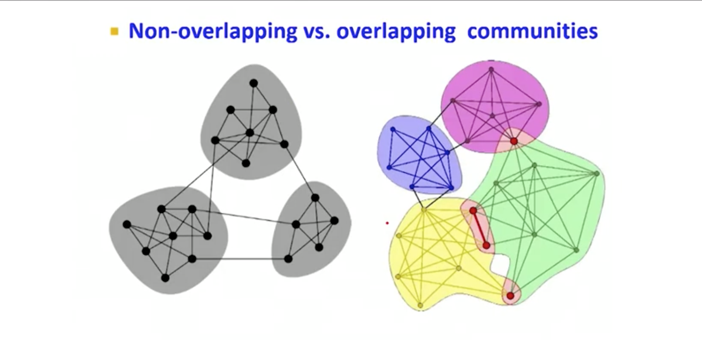

# Teoria dos Grafos

> Conteúdo teórico-matemático sobre teoria dos grafos

## Sumário

[TOC]

## O que é um grafo

Um grafo pode ser entendido como um conjunto de nós (ou vértices) e relacionamentos (ou arestas), um nó é representado por um círculo que pode ter uma série de propriedades:

- Um atributo pode ser qualquer tipo de chave e valor, por exemplo `(alice {nome: 'Alice'})` é um nó com a propriedade `nome` sendo `Alice`
- Uma ou mais labels que identificam a categoria daquele nó, por exemplo, `(alice: Pessoa)` indica que o nó `alice` é da categoria `Pessoa`

Um relacionamento ou aresta é a ligação de um nó com outro nó. Isto representa uma conexão lógica entre os nós, por exemplo, uma pessoa que segue outra pessoa no Twitter seria representada por um nó pessoa e uma relação direcionada de seguidor de outro nó. As arestas devem possuir labels e também podem possuir atributos, no caso da nossa ligação de seguidor, um atributo poderia ser `desde: <data>`.

Grafos podem ser entendidos como tipos menos restritos de árvores. Enquanto, por exemplo, uma árvore binária só possui nós que se ligam a dois outros nós, um grafo aberto não tem esta restrição. **Toda árvore é um grafo, mas nem todo grafo é uma árvore**.

### Grafos e árvores

O que difere um grafo de uma árvore? Inicialmente, por exemplo, uma árvore pode fluir somente em uma direção, da raiz para as folhas, das folhas para a raiz . Uma árvore também pode ter somente conexões direcionadas de uma única via - como um nó ter somente um pai, ou um pai só ter dois filhos. **Uma árvore também não pode possuir ligações cíclicas**

Em um grafo, não temos nenhuma restrição deste tipo, qualquer nó pode se conectar a qualquer outro nó, direcionado ou não direcionado, podem haver ciclos e muito mais.

Todo o grafo, no entanto, deve seguir algumas regras como, por exemplo: todo grafo deve ter pelo menos um nó. Grafos que só possuem um único nó são geralmente chamados de **singleton**.

## Grafos direcionados e não direcionados

A maioria dos grafos pode ficar bastante complexo, os grafos que vamos verificar são os chamados **grafos direcionados/dirigidos e grafos não-direcionados/não-dirigidos**. Um grafo não dirigido pode possuir arestas que se ligam em qualquer direção, de qualquer forma possível:

Diferenciar arestas é uma das formas de reconhecer e definir tipos diferentes de grafos, por isso, elas são consideradas as mais importantes partes de um grafo. Arestas que possuem direção de fluxo – que mostram de onde vem e para onde vão – chamadas de **arestas direcionadas ou dirigidas**, caso contrário, são chamadas de **arestas não-direcionadas ou não-dirigidas**. 

### Arestas direcionadas

Em um caso direcionado, dois nós estão conectados de forma bastante específica, o nó `A` está direcionado ao nó `B` de forma única, como no exemplo a seguir; exista apenas *uma* forma de viajar entre esses nós – somente há uma direção que podemos ir. É comum nos referirmos como **nó de origem** ao nó que está no início do relacionamento e **nó de destino** para o nó que está no final do mesmo. Em uma aresta direcionada, podemos somente viajar **da origem para o destino**, nunca ao contrário.

### Arestas não-direcionadas

Em arestas não direcionadas isso não existe. Com elas podemos viajar para qualquer lado, sendo assim o caminho entre estes dois nós é *bidirecional*, o que significa que não temos nós de origem ou destino fixados. 

Essa distinção é extremamente importante, porque as arestas de um grafo determinam como esse grafo vai ser chamado. Se todas as arestas são **direcionadas** o grafo é chamado de **grafo dirigido ou dígrafo**, caso contrário temos um **grado não-dirigido**.

## Origem dos grafos

A maioria dos conceitos em computação são emprestados ou reaplicados a partir da matemática ou lógica. Com grafos não foi diferente, além disso, não tivemos muitas alterações de nomes ou coisas do tipo. Então a maioria dos conceitos e nomenclaturas são exatamente as mesmas, tanto para a teoria matemática dos grafos, criada por Leonhard Euler em meados de 1780, quando para a teoria computacional dos grafos que estamos vendo aqui.

Um exemplo prático: Em termos matemáticos, podemos descrever um grafo como **pares ordenados** de vértices e arestas que podem ser descritos como $G = (V, E)$, onde `V` são os **vértices** e `E` são as **arestas** (vem de *edges* em inglês).

Mas como definimos um grafo que tem mais de um nó ou mais de uma aresta – como é a maioria dos casos? Podemos utilizar a mesma definição que já utilizamos antes, de $G = (V, E)$, isto pois `V` e `E` são **conjuntos** de vértices e arestas. Vamos a um exemplo:

Veja que temos um grafos não dirigido, escrevemos nossos pares ordenados `V` e `E` de forma que formem um conjunto de nós. Nosso conjunto `V` é um conjunto desordenado de referências para todos os nossos nós e nosso conjunto `E` é também um conjunto **desordenado** de ligações – desordenado porque nosso grafo não é direcionado!

> Um conjunto de ligações desordenadas completo poderia conter ligações do tipo $\{v1,v2\}$ e também do tipo $\{v2, v1\}$ já que não são direcionadas

### Definindo grafos ordenados

E se tivéssemos um grafo dirigido? Então podemos dar este exemplo:

Veja que agora estamos definindo nossos vértices e nossas arestas de forma ordenada. Então não poderíamos comutar a ordem dos nós de origem e destino porque eles importam.

## Grafos da vida real

Redes sociais são grandes exemplos de grafos. O Facebook, por exemplo, é uma rede enorme e também um tipo de grafo. Vamos definir melhor, o Facebook permite que você adicione vários amigos, automaticamente, quando uma pessoa te adiciona, você também adiciona a pessoa. Essa relação entre dois usuários (ou nós) é bidirecional, não é possível que uma pessoa seja amigo de outra sem que a outra seja amigo da primeira também. Então não temos um conceito de nós de origem ou destino, portanto o Facebook pode ser um grafo não-dirigido.

Já o Twitter, por outro lado, permite que uma pessoa siga outra pessoa sem que a pessoa que está sendo seguida, de fato, siga de volta a primeira. Portanto, agora temos o conceito de nós de origem e destino, já que a relação entre um e outro segue um fluxo. É possível que um nó siga outro, mas sem que a relação seja mútua:

A grande diferença aqui é que, quando uma pessoa te segue de volta, não alteramos a direção da aresta ou então transformamos uma relação direcional em uma relação bidirecional, na verdade, criamos outra aresta no sentido contrário.

## Community detection

Detecção de comunidades pode ser uma das ferramentas mais importantes para detecção de módulos funcionais ou conjuntos de dados relacionados em um grafo, por exemplo, a detecção de conjuntos de proteínas em um grafo de interação de proteínas, ou então detecção de comunidades em um grafo de redes sociais. A ideia é que consigamos identificar esses clusters automaticamente através de algoritmos de detecção de comunidades.

Uma das propriedades mais interessantes dos clusters é que eles podem se sobrepor de várias formas:

Na imagem anterior, temos uma comunidade não sobreposta, onde os nós estão claramente separados em grupos e existem alguns nós entre esses grupos que ligam uns com os outros, as chamadas pontes locais.