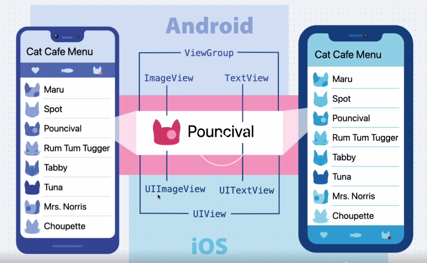
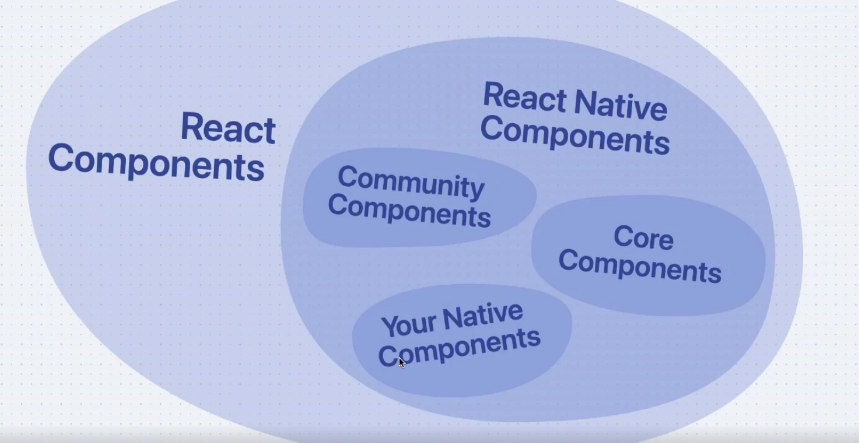
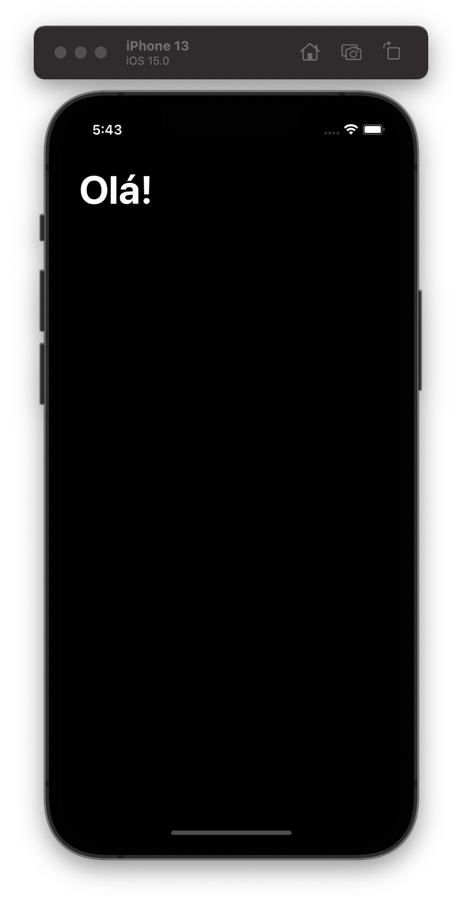
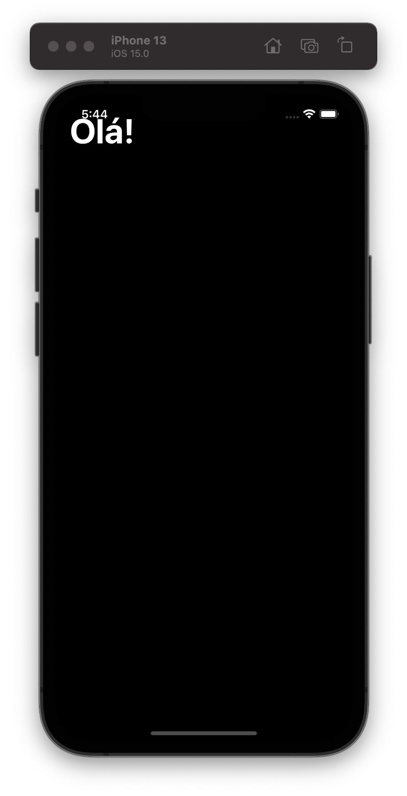

# React Native

<!-- @import "[TOC]" {cmd="toc" depthFrom=1 depthTo=6 orderedList=false} -->

<!-- code_chunk_output -->

- [React Native](#react-native)
  - [O que é o RN](#o-que-é-o-rn)
    - [Como funciona](#como-funciona)
  - [Ambiente](#ambiente)
  - [Criando um projeto com o CLI](#criando-um-projeto-com-o-cli)
    - [Executando em ambiente Linux](#executando-em-ambiente-linux)
  - [Estrutura do JSX](#estrutura-do-jsx)
  - [Arquivos CSS e estilos](#arquivos-css-e-estilos)
    - [SafeAreaView e iOS](#safeareaview-e-ios)
  - [Incluindo outros componentes](#incluindo-outros-componentes)
  - [Imutabilidade com useState](#imutabilidade-com-usestate)
  - [Componentes customizados](#componentes-customizados)
  - [Listas](#listas)
  - [Hooks](#hooks)
    - [useEffect](#useeffect)
  - [Manipulando a Status Bar](#manipulando-a-status-bar)
  - [TypeScript](#typescript)

<!-- /code_chunk_output -->

## O que é o RN

React Native é uma ferramenta para criar aplicações nativas para iOS e Android usando JavaScript ou TypeScript e o próprio React.

### Como funciona

O RN recebe um código JavaScript e compila tudo para um bundle.js através do que é chamado de Metro Bundler, dentro do aplicativo, os elementos JSX são lidos pelo JS Core e convertidos para elementos nativos de acordo com a linguagem.



Veja que para cada um dos elementos criados, o RN vai criar um elemento nativo da plataforma. Além disso, todo o componente RN é um componente React, e temos como criar nossos próprios componentes, bem como usar componentes da comunidade.



## Ambiente

Vamos usar o [VSCode](http://code.visualstudio.com).

Para configurar o RN vamos usar o manual da RocketSeat [neste link](https://react-native.rocketseat.dev/).

## Criando um projeto com o CLI

Podemos criar um novo projeto do RN usando o comando `npx react-native init <nome>`, isso vai criar ua pasta do projeto e tudo o que é necessário para ele rodar.

A estrutura de pastas é a seguinte:

- Pastas `android` e `ios`: Conteúdo nativo das plataformas em questão, ali ficam as bibliotecas e outras coisas nativas das plataformas do Android e iOS.
- Temos a pasta `node_modules` para os módulos do React Native.
- `.buckconfig`: Arquivo de configuração do Buck é um arquivo de configuração do builder do Buck que é usado para compilar o ambiente do RN.

Os demais arquivos são nativos do JS, como o `.prettierrc`, `babel.config` e etc.

Para iniciar um projeto temos que rodar o comando `npm run ios` ou `npm run android` para cada plataforma.

### Executando em ambiente Linux

Em ambientes Linux, o metro bundler não vai abrir naturalmente, você vai precisar iniciar o emulador do Android, e depois iniciar o Metro bundler com o `npm start`.

## Estrutura do JSX

Por padrão, o arquivo `App.js` é o arquivo principal do projeto, ele é o primeiro arquivo que o React Native vai rodar. Ele é o nosso App em si.

Para começarmos, vamos apagar tudo que está no arquivo `App.js` e criar tudo de novo, a primeira coisa que precisamos fazer é importar o React para poder usar a sintaxe do JSX.

```jsx
import React from 'react'
```

Depois podemos importar o que vamos utilizar do React Native. Vamos importar o elemento `View`, que é uma `<div>` e o elemento `Text` que é basicamente um componente de texto, depois vamos exportar um objeto padrão do react como uma função, um componente.

```jsx
import React from 'react'
import { View, Text } from 'react-native'

export default function App () {
  return (
    <View style={ {
      flex: 1,
      justifyContent: 'center',
      alignItems: 'center'
    } }>
      <Text style={ { color: 'white' } }>Hello World</Text>
    </View>
  )
}
```

É bem comum utilizarmos a `View` como agrupador, mas se não quisermos trazer ela como elemento principal, já que o JSX só pode ter um unico elemento sendo retornado, podemos usar o `Fragment`, que é como o `<template>` do Vue:

```jsx
import React, { Fragment } from 'react'
import { View, Text } from 'react-native'

export default function App () {
  return (
    <Fragment>
      <View style={ {
        flex: 1,
        justifyContent: 'center',
        alignItems: 'center'
      } }>
        <Text style={ { color: 'white' } }>Hello World</Text>
      </View>
    </Fragment>
  )
}
```

Existe um shorthand para o `Fragment`, que é `<>`:

```jsx
import React from 'react'
import { View, Text } from 'react-native'

export default function App () {
  return (
    <>
      <View style={ {
        flex: 1,
        justifyContent: 'center',
        alignItems: 'center'
      } }>
        <Text style={ { color: 'white' } }>Hello World</Text>
      </View>
    </>
  )
}
```

É uma boa prática que criemos uma pasta `src` para poder criar os arquivos que nós criamos, enquanto o resto são as páginas que são criadas pelo RN. Então vamos mover o que temos no arquivo App para dentro da pasta `src/pages/Home.js` e ai deixamos o nosso arquivo principal só com a página inicial exportando o componente Home.

```jsx
// App.js
import React from 'react'
import { Home } from './src/pages/Home'

export default function App () {
  return (
    <Home />
  )
}
```

## Arquivos CSS e estilos

Diferentemente do React onde temos arquivos CSS próprios, no RN temos que criar uma estilização a parte em um componente chamado `StyleSheet`.

```jsx
import React from 'react'
import { View, Text, StyleSheet } from 'react-native'

export function Home () {
  return (
    <>
      <View style={styles.container}>
        <Text style={styles.whiteText}>Hello World</Text>
      </View>
    </>
  )
}

const styles = StyleSheet.create({
  container: {
    flex: 1,
    justifyContent: 'center',
    alignItems: 'center'
  },
  whiteText: {
    color: 'white'
  }
})
```

### SafeAreaView e iOS

No caso do iOS, existe um componente chamado `SafeAreaView` que pode ser substituído no lugar fa `View` para fazer o conteúdo ser renderizado somente na área útil do celular:

```jsx
import React from 'react'
import { Text, StyleSheet, SafeAreaView } from 'react-native'

export function Home () {
  return (
    <>
      <SafeAreaView style={styles.container}>
        <Text style={[styles.textWhite, styles.title]}>Olá!</Text>
      </SafeAreaView>
    </>
  )
}

const styles = StyleSheet.create({
  container: {
    flex: 1
  },
  textWhite: {
    color: 'white'
  },
  title: {
    padding: 20,
    fontSize: 45,
    textAlign: 'left',
    fontWeight: 'bold'
  }
})
```

Teremos algo assim:



Enquanto sem ele, teremos algo assim:



## Incluindo outros componentes

Podemos incluir uma caixa de texto simples na nossa tela, usando o componente `TextInput`:

```jsx
import React from 'react'
import { Text, StyleSheet, SafeAreaView, TextInput } from 'react-native'

export function Home () {
  return (
    <>
      <SafeAreaView style={styles.container}>
        <Text style={[styles.textWhite, styles.title]}>Olá!</Text>
        <TextInput
          style={[styles.input, styles.textWhite]}
        />
      </SafeAreaView>
    </>
  )
}

const styles = StyleSheet.create({
  container: {
    flex: 1
  },
  textWhite: {
    color: 'white'
  },
  title: {
    padding: 20,
    fontSize: 45,
    textAlign: 'left',
    fontWeight: 'bold'
  },
  input: {
    backgroundColor: '#1f1e25',
    borderRadius: 10,
    fontSize: 20,
    margin: 10,
    padding: 10
  }
})
```

Porém vamos notar que o input fica maior no Android do que no iOS, então podemos fazer um condicional com o Platform para fazer o input ser maior ou menor dependendo da plataforma:

```jsx
import React from 'react'
import { Text, StyleSheet, SafeAreaView, TextInput, Platform } from 'react-native'

export function Home () {
  return (
    <>
      <SafeAreaView style={styles.container}>
        <Text style={[styles.textWhite, styles.title]}>Olá!</Text>
        <TextInput
          style={[styles.input, styles.textWhite]}
        />
      </SafeAreaView>
    </>
  )
}

const styles = StyleSheet.create({
  container: {
    flex: 1
  },
  textWhite: {
    color: 'white'
  },
  title: {
    padding: 20,
    fontSize: 45,
    textAlign: 'left',
    fontWeight: 'bold'
  },
  input: {
    backgroundColor: '#1f1e25',
    borderRadius: 10,
    fontSize: 20,
    margin: 10,
    padding: Platform.OS === 'ios' ? 15 : 10
  }
})
```

Podemos ainda fazer funções com nossos estilos e adicionar outros componentes como o `TouchableOpacity` que é um componente que, ao clicar terá sua opacidade reduzida:

```jsx
import React from 'react'
import {
   Text,
   StyleSheet,
   SafeAreaView,
   TextInput,
   Platform,
   TouchableOpacity,
   View
} from 'react-native'

export function Home () {
  return (
    <>
      <SafeAreaView style={styles.container}>
        <Text style={[styles.textColor('white'), styles.title()]}>
          Olá, Lucas!
        </Text>

        <TextInput
          style={[styles.input, styles.textColor('white')]}
          placeholder="Adicionar Skill"
          placeholderTextColor="#555"
        />

        <TouchableOpacity
          style={styles.button}
          activeOpacity={.8}
        >
          <TextInput style={[
            styles.textColor('white'),
            styles.textSize(18)
          ]}>Add</TextInput>
        </TouchableOpacity>

        <View>
          <Text style={[styles.textColor('white'), styles.title(30)]}>
            Minhas Skills
          </Text>
        </View>
      </SafeAreaView>
    </>
  )
}

const styles = StyleSheet.create({
  container: {
    flex: 1
  },
  textColor: (color) => ({
    color: 'white'
  }),
  title: (font = 45) => ({
    padding: 20,
    fontSize: font,
    textAlign: 'left',
    fontWeight: 'bold'
  }),
  input: {
    backgroundColor: '#1f1e25',
    borderRadius: 10,
    fontSize: 20,
    margin: 10,
    padding: Platform.OS === 'ios' ? 15 : 10
  },
  button: {
    backgroundColor: '#1e4def',
    borderRadius: 5,
    padding: 15,
    margin: 10,
    alignContent: 'center',
    alignItems: 'center'
  },
  textSize: (size) => ({ fontSize: size })
})
```

## Imutabilidade com useState

O estado de uma aplicação é um objeto que deve ser imutável, com as antigas versões do React, tínhamos muitos problemas com mutabilidade de objetos e de estados ao longo do tempo, por isso que agora usamos o `useState`.

O `useState` é uma função do React que retorna um array com duas propriedades, a primeira é a sua propriedade criada e a segunda é uma função para alterar a primeira sem modificar sua referência. Vamos fazer este teste no nosso componente de texto:

```jsx
export function Home () {
  const [skill, setSkill] = useState('')
  return (
    <SafeAreaView style={styles.container}>
      <View nativeID="header">
        <Text style={[styles.textColor('white'), styles.title()]}>
          Olá, Lucas!
        </Text>
        <TextInput
          style={[styles.input, styles.textColor('white')]}
          placeholder="Adicionar Skill"
          placeholderTextColor="#555"
          onChangeText={setSkill} // Estamos setando a skill aqui
        />
        <TouchableOpacity
          style={styles.button}
          activeOpacity={.8}
          onPress={handleSkillAdd(skill)} // Add skill é outra função
        >
          <TextInput style={[
            styles.textColor('white'),
            styles.textSize(18)
          ]}>Add</TextInput>
        </TouchableOpacity>
      </View>

      <View nativeID='my-skills'>
        <Text style={[styles.textColor('white'), styles.title(30)]}>
          Minhas Skills
        </Text>
      </View>
    </SafeAreaView>
  )
}

function handleSkillAdd (skill) {
  return () => {
    console.log(skill)
  }
}
```

Podemos implementar a função `handleSkillAdd` com um outro state que contém todas as skills, então podemos adicionar um novo item no array:

```jsx
export function Home () {
  const [skill, setSkill] = useState('')
  const [skills, setSkills] = useState([])
}
```

E então:

```jsx
<TouchableOpacity
  style={styles.button}
  activeOpacity={.8}
  onPress={handleSkillAdd(skill, setSkills)}
>
  <TextInput style={[
    styles.textColor('white'),
    styles.textSize(18)
  ]}>Add</TextInput>
</TouchableOpacity>
```

E nossa função fica assim:

```js
function handleSkillAdd (skill, setSkills) {
  return () => {
    if (skill) setSkills(oldState => [...oldState, skill])
  }
}
```

## Componentes customizados

Podemos exportar um componente para um outro arquivo, por exemplo, vamos criar um botão que será usado na tela, para isso vamos criar um novo arquivo em `src/components/Button.js`:

```jsx
import React from 'react'
import {TouchableOpacity, Text, StyleSheet} from 'react-native'

export function Button ({onPress, text}) {
  return (
    <TouchableOpacity
      style={styles.button}
      activeOpacity={.8}
      onPress={onPress}
    >
      <Text style={styles.text}>{text}</Text>
    </TouchableOpacity>
  )
}

const styles = StyleSheet.create({
  button: {
    backgroundColor: '#1e4def',
    borderRadius: 5,
    padding: 15,
    margin: 10,
    alignContent: 'center',
    alignItems: 'center'
  },
  text: {
    color: 'white',
    fontSize: 18
  }
})
```

E ai podemos usá-lo no nosso componente principal:

```jsx
<Button
  text="Add"
  onPress={handleSkillAdd(skill, setSkills, this.textInput)}
/>
```

## Listas

Existem duas formas de se trabalhar com listas no RN, a primeira é usando uma `ScrollView`, ela é muito mais leve que a `FlatList`, mas não é muito recomendada para listas muito grandes, porque renderiza todos os elementos da lista ao mesmo tempo, o que pode gerar um lag.

```jsx
import React, { useState } from 'react'
import {
  Text,
  SafeAreaView,
  TextInput,
  View,
  ScrollView
} from 'react-native'
import { Button } from '../components/Button'
import { SkillCard } from '../components/SkillCard'
import globalStyle from '../styles/global'


export function Home () {
  const [skill, setSkill] = useState('')
  const [skills, setSkills] = useState([])
  return (
    <SafeAreaView style={{flex: 1}}>
      <View nativeID="header">
        <Text style={[globalStyle.textColor('white'), globalStyle.title()]}>
          Olá, Lucas!
        </Text>
        <TextInput
          style={[globalStyle.input, globalStyle.textColor('white')]}
          placeholder="Adicionar Skill"
          placeholderTextColor="#555"
          onChangeText={setSkill}
          ref={(input) => { this.textInput = input }}
        />
        <Button
          text="Add"
          onPress={handleSkillAdd(skill, setSkills, this.textInput)}
        />
      </View>

      <View nativeID='my-skills'>
        <Text style={[globalStyle.textColor('white'), globalStyle.title(30)]}>
          Minhas Skills
        </Text>

        <ScrollView>
        {
          skills.map((skill, index) => (
            <SkillCard
              skillName={skill}
              key={index}
              onPress={handleSkillRemove(index, setSkills)}
            />
          ))
        }
        </ScrollView>

      </View>
    </SafeAreaView>
  )
}

function handleSkillAdd (skill, setSkills, skillInput) {
  return () => {
    if (skill) setSkills(oldState => [...oldState, skill])
    skillInput.clear()
  }
}

function handleSkillRemove (index, setSkills) {
  return () => {
    setSkills(oldState => oldState.filter((_, i) => i !== index))
  }
}
```

Isso vai garantir o scroll, mas não vai dar muito certo quando a gente precisa trabalhar com listas muito grandes.

Para isso podemos usar a `FlatList` que só carrega os elementos que estão dentro da visualização. A FlatList tem um funcionamento um pouco diferente, ela recebe o array de dados, uma função de extração de `key` e também o item que vai ser rederizado:

```jsx
<FlatList
  data={skills}
  keyExtractor={(_, index) => index}
  renderItem={({item: skillItem, index},) => (
    <SkillCard
      skillName={skillItem}
      onPress={handleSkillRemove(index, setSkills)}
    />
  )}
/>
```

Assim podemos nos livrar do map:

```jsx
import React, { useState } from 'react'
import {
  Text,
  SafeAreaView,
  TextInput,
  View,
  FlatList
} from 'react-native'
import { Button } from '../components/Button'
import { SkillCard } from '../components/SkillCard'
import globalStyle from '../styles/global'


export function Home () {
  const [skill, setSkill] = useState('')
  const [skills, setSkills] = useState([])
  return (
    <SafeAreaView style={{flex: 1}}>
      <View nativeID="header">
        <Text style={[globalStyle.textColor('white'), globalStyle.title()]}>
          Olá, Lucas!
        </Text>
        <TextInput
          style={[globalStyle.input, globalStyle.textColor('white')]}
          placeholder="Adicionar Skill"
          placeholderTextColor="#555"
          onChangeText={setSkill}
          ref={(input) => { this.textInput = input }}
        />
        <Button
          text="Add"
          onPress={handleSkillAdd(skill, setSkills, this.textInput)}
        />
      </View>

      <View nativeID='my-skills'>
        <Text style={[globalStyle.textColor('white'), globalStyle.title(30)]}>
          Minhas Skills
        </Text>

        <FlatList
          data={skills}
          keyExtractor={(_, index) => index}
          renderItem={({item: skillItem, index},) => (
            <SkillCard
              skillName={skillItem}
              onPress={handleSkillRemove(index, setSkills)}
            />
          )}
        />

      </View>
    </SafeAreaView>
  )
}

function handleSkillAdd (skill, setSkills, skillInput) {
  return () => {
    if (skill) setSkills(oldState => [...oldState, skill])
    skillInput.clear()
  }
}

function handleSkillRemove (index, setSkills) {
  return () => {
    setSkills(oldState => oldState.filter((_, i) => i !== index))
  }
}
```

## Hooks

Hooks são APIs de composição que geralmente começam com a palavra "use", e são usadas para criar componentes reutilizáveis. Um dos hooks que temos é o `useState`, temos o `useEffect`, `useRef` e muitos outros.

Os Hooks são ligados diretamente aos renders da tela, quando um hook é alterado, a renderização é refeita. O mesmo não é feito quando temos uma variável normal.

### useEffect

O `useEffect` é executado no momento da montagem do componente. Ele recebe dois parâmetros, o primeiro é uma função e o segundo é um array de dependências.

Essencialmente, o `useEffect` é uma função que será executada quando o componente for montado, e quando o array de dependências for alterado. Portanto podemos criar um efeito que vai ser executado sempre que algum outro componente for alterado.

Alguns exemplos de uso são quando queremos carregar dados de uma API logo no início da renderização do componente, ou então quando queremos carregar mais produtos de uma lista quando a página for alterada.

Um outro uso no nosso app pode ser para poder limpar a caixa de texto quando adicionarmos uma nova skill. Para isso vamos adicionar o estado de `skills` como dependência e vamos alterar a nossa função de adição de itens para poder limpar a caixa de texto.

```jsx
import React, { useEffect, useState } from 'react'
import {
  Text,
  SafeAreaView,
  TextInput,
  View,
  FlatList
} from 'react-native'
import { Button } from '../components/Button'
import { SkillCard } from '../components/SkillCard'
import globalStyle from '../styles/global'


export function Home () {
  const [skill, setSkill] = useState('')
  const [skills, setSkills] = useState([])

  useEffect(() => this.textInput.clear() , [skills])

  return (
    <SafeAreaView style={{flex: 1}}>
      <View nativeID="header">
        <Text style={[globalStyle.textColor('white'), globalStyle.title()]}>
          Olá, Lucas!
        </Text>
        <TextInput
          style={[globalStyle.input, globalStyle.textColor('white')]}
          placeholder="Adicionar Skill"
          placeholderTextColor="#555"
          onChangeText={setSkill}
          ref={(input) => { this.textInput = input }}
        />
        <Button
          text="Add"
          onPress={handleSkillAdd(skill, setSkills)}
        />
      </View>
    </SafeAreaView>
  )
}

function handleSkillAdd (skill, setSkills) {
  return () => {
    if (skill) setSkills(oldState => [...oldState, skill])
  }
}
```

Veja que estamos usando uma propriedade `ref` para poder pegar a referência do objeto input.

## Manipulando a Status Bar

O RN tem um componente chamado `StatusBar` que é responsável por manipular a barra de status. Nele podemos incluir o componente para podermos definir, por exemplo, cores da nossa barra de tarefa. Podemos colocar este componente no nosso componente principal, ou podemos colocar no `App.js` e usar o `StatusBar` como componente filho.

```jsx
import React from 'react'
import { StatusBar } from 'react-native'
import { Home } from './src/pages/Home'

export default function App () {
  return (
    <>
      <StatusBar barStyle='light-content' />
      <Home />
    </>
  )
}
```

## TypeScript
